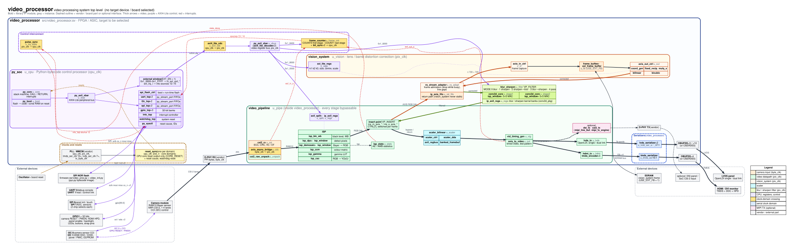

# video_processor

Top level of a complete video processing system, built from the IP library
(`../../ip`) and `../vision_system`:

- **Camera input**: MIPI CSI-2 into `video_pipeline` (ISP).
- **Lens correction**: `vision_system` at the pipeline's insert point.
- **Blur / sharpen**: `blur_sharpen` after `vision_system` in the same
  insert loop, with modes for blur, sharpen, sharpen then blur, blur then
  sharpen, and pass-through.
- **Scaler and outputs**: HDMI / DVI and LVDS outputs (MIPI DSI / CSI-2 optional).
- **Control**: a `py_soc` CPU that boots Python firmware from SPI flash and
  programs everything through its external register window. Its external
  interfaces are 2x UART, 2x I2C, 2x SPI, 96 GPIO and the SPI flash.

No target device or board is selected: the design is technology
independent. A board wrapper adds the PLL, the vendor D-PHYs and the
differential I/O buffers.



`docs/block_diagram.svg` shows the video datapath (`u_pipe` and the
serializers) in more detail.

## Directory structure

| Path | Contents |
|------|----------|
| `src/configuration.sv` | interfaces built: `VP_CSI2_RX`, `VP_HDMI`, `VP_LVDS`, `VP_DSI`, `VP_CSI2_TX`, `VP_VISION`, `VP_FILTER` (the last two imply `VP_INSERT`) |
| `src/video_processor.sv` | top level |
| `src/vs_stream_adapter.sv` | glue between the insert point and vision_system |
| `src/frame_counter.sv` | frame counters: frames out of the first pipeline stage and into the last one, with end-of-frame interrupts |
| `sw/video_init.py` | firmware part 1: py_soc CPU initialisation only (boot report, peripheral self-test, CPU register dump, UART text output) |
| `sw/video_proc.py` | firmware part 2, the program: after the CPU initialisation, video set-up (camera frame gap, colour / monochrome ISP programming, frame counter), video start, frame-counter interrupt reports (imports `video_init.py`; `pyc.py` builds one image from both) |
| `scripts/build.f` | RTL file list (`configuration.sv` first), relative to this directory |
| `scripts/run_sim.sh` | compile the firmware, run the system test (Icarus), `--lint` for Verilator |
| `tb/` | `video_processor_tb.sv` system test, its test tasks in `tb/tests/video_processor_tests.sv`, `tb/scripts/build.f` |
| `synth/run_yosys.sh` | Yosys Xilinx 7-series synthesis (sv2v + library flow) |
| `docs/` | `system_block_diagram.*`, `block_diagram.*` (`.dot` is the source) |
| `constraints/` | board constraints (once a board is chosen) |
| `include/` | shared packages (none yet) |
| `ci/run_checked.sh` | pass/fail from the log, used by the Makefile |

## Usage

```
make sim       # system test: firmware boot, camera -> ISP -> vision_system -> HDMI / LVDS
make cov       # sim + ip-test with Verilator code coverage -> build/coverage/summary.txt
make ip-test   # full video_pipeline system test (bit-exact ISP model, every output)
make synth     # Yosys -> build/yosys
make diagram   # re-render the diagrams
```

## Blocks

| Instance | IP module | Function |
|----------|-----------|----------|
| `u_cpu` | `py_soc` (`py_core`, `py_boot`, `py_axil_xbar`, `spi_flash_ctrl`, `uart_top` ×2, `i2c_top` ×2, `spi_top` ×2, `gpio_top` ×3, `intc_top`, `watchdog_top`, `py_sysctl`, `py_stream_port`) | control CPU, `EXT_EN = 1` |
| `u_axil_cdc` | `axi4_lite_cdc` | CPU register access cpu_clk → pix_clk |
| `u_vbus` | `py_axil_xbar` (`axi4_lite_decoder`) | video register bus |
| `u_irq_stats` | `pulse_sync` | statistics-done interrupt pix_clk → cpu_clk |
| `u_frame_cnt` | `frame_counter` (`ip_axil_regs`) | COUNT0: frames out of `csi2_raw_unpack` (first stage), COUNT1: frames into `axis_to_video` (last stage); an end-of-frame interrupt per counter |
| `u_irq_frame0/1` | `bit_sync` | frame-counter interrupts pix_clk → cpu_clk |
| `u_pipe` | `video_pipeline` | `csi2_rx` → ISP (`isp_*`) → insert point → `scaler_bilinear` → `vid_timing_gen` / `axis_to_video` → `hdmi_tx` / `lvds_tx` / `dsi_tx` / `csi2_tx` |
| `u_vs_adapt` | `vs_stream_adapter` (`ip_axis_fifo`) | frame admission, line gaps, return FIFO |
| `u_vision` | `vision_system` (`axis_in_ctrl`, `frame_buffer` / `ext_frame_buffer`, `axis_out_ctrl`, `coord_gen`, `bilinear`, `bicubic`, `axi_lite_regs`) | lens / barrel distortion correction |
| `u_filter` | `blur_sharpen` (`conv2d_core` ×2, `isp_window`, `ip_axil_regs`) | blur / sharpen after vision_system; MODE 0 blur, 1 sharpen, 2 sharpen→blur, 3 blur→sharpen, 4 pass-through; same latency in every mode |
| `u_tmds_ser` | `tmds_serializer` | 10:1 TMDS |
| `u_lvds_ser_a`, `u_lvds_ser_b` | `lvds_serializer` | 7:1 LVDS, links A / B |
| `u_rst_*` | `reset_sync` | one per clock domain: cpu_clk from `arst_n`; the core domains only from the CPU system's core reset output |

### CPU address map (`mem32[]` in the firmware)

| Address | Block |
|---------|-------|
| 0x0_0100 – 0x0_C1FF | py_soc peripherals (see `py_soc.sv`) |
| 0x1_0000 – 0x1_7FFF | video_pipeline (scaler at 0x1_4000) |
| 0x1_8000 – 0x1_80FF | vision_system |
| 0x1_8200 – 0x1_83FF | blur_sharpen |
| 0x1_8400 – 0x1_84FF | frame_counter |

Interrupt controller sources:

| Source | Interrupt |
|--------|-----------|
| 12 | isp_stats frame done (use edge mode) |
| 13 | end of frame at the first pipeline stage (`frame_counter` STATUS[0], level, write 1 to clear) |
| 14 | end of frame at the last pipeline stage (`frame_counter` STATUS[1], level, write 1 to clear) |
| 15 | `ext_irq_i` (the firmware's self-test also uses it as its software interrupt) |

### frame_counter registers (0x1_8400)

| Offset | Name | Description |
|--------|------|-------------|
| 0x00 | ID | "FCNT" |
| 0x04 | VERSION | 0x0001_0000 |
| 0x08 | IRQ_EN | [0] first stage, [1] last stage |
| 0x0C | STATUS | [0] / [1] end of frame seen, write 1 to clear |
| 0x10 | CLEAR | write 1s: clear COUNT0 / COUNT1 |
| 0x20 | COUNT0 | frames out of `csi2_raw_unpack` |
| 0x24 | COUNT1 | frames into `axis_to_video` |

The end-of-frame markers come from `video_pipeline` (`eof_in_o`, `eof_out_o`): the last
pixel of a frame, counted in lines of FRAME_SIZE height (first stage) and VTG v-active
height (last stage).

### Reset and start-up

- **`arst_n`** (external, asynchronous, active low) resets the CPU system. Its release
  starts the boot: `py_boot` loads the firmware from SPI flash, then the firmware tests
  the CPU peripherals.
- **Core logic reset:** every other block (`video_pipeline`, `vision_system`,
  `blur_sharpen`, `frame_counter`, the serializers) stays in reset until the firmware,
  after a successful boot with every self-test passed, writes 1 to py_soc SYSCTL
  `CORE_RESET` (0x0110). Its output, `core_rst_n_o`, is the core logic's only reset,
  synchronised into each core clock domain; the `core_rst_n_o` port shows it to the board.
  `arst_n` reaches the core logic through the CPU: it resets py_soc, which clears
  `CORE_RESET` at the next cpu_clk edge (so cpu_clk must run for the core to be reset).
- **Self-test failed:** the core logic stays in reset and the firmware skips the video sections.
- **Watchdog reset:** resets the CPU and clears `CORE_RESET`, so the core logic goes back
  into reset until the firmware has booted and released it again.

### Firmware

`sw/video_proc.py` is the program; `from video_init import *` pulls in `sw/video_init.py`
(`pyc.py` inlines it). The video starts only after the CPU initialisation is complete. The
UART 0 report (`build/sim/cpu_bootup.txt` in simulation):

1. Boot-up sequence, 2. CPU peripheral self-test, 3. CPU register dump (`video_init.py`;
   the dump is skipped with the GPIO0[31] quick-simulation strap, `run_sim.sh --quick`).
   With every self-test passed the CPU then releases the core logic reset (SYSCTL
   `CORE_RESET`, read back as a [PASS] line); otherwise the video sections are skipped.
4. Video set-up, with the camera not streaming: camera out of reset, camera frame gap,
   vision_system, blur_sharpen, video_pipeline, image format, frame counter and statistics
   interrupts. The frame gap is the time from the end of one camera frame to the start of
   the next: `FRAME_GAP_NS` (1280 ns) written to the camera's control registers 0x20–0x21
   (high byte first, ns) over I2C 0 and read back. The image format pin GPIO0[30]
   (1 monochrome: every ISP stage bypassed; 0 colour: RGGB demosaic on) is read here and on
   every change (GPIO0 edge interrupt, serviced first so it lands within the frame gap);
   GPIO0[2] shows the format programmed.
5. Video register dump (skipped with the GPIO0[31] strap).
6. Video start: camera "stream on", frames counted, outputs checked.
7. Frame counters and image sequence: the interrupt handler reads COUNT0 at every
   first-stage end of frame and COUNT1 at every last-stage end of frame; while the camera
   board sends its image sequence (GPIO0[29] = 1) each end of frame is reported on UART 0
   with the count read. Frames follow each other at the frame gap; frames that arrive while
   vision_system is busy are dropped by `vs_stream_adapter` before the last stage (a longer
   gap passes more of them).
8. Summary and END OF REPORT.

## Changes made to library IP for this design

All of these default off, so other users of the library are unaffected.

- **`py_soc`**: `EXT_EN` adds an external AXI4-Lite master window at
  0x1_0000–0x1_FFFF (`m_ext_axil_*`). `ext_irq_i[3:0]` drives interrupt
  controller sources 12–15. SYSCTL `CORE_RESET` (0x0110) drives the new
  `core_rst_n_o` output, the reset of the logic outside the CPU (held low from
  every system reset until the firmware writes 1). Its self-test passes and
  now also checks `core_rst_n_o`.
- **`video_pipeline`**: `` `VP_INSERT`` adds an insert point after
  `isp_csc` (`ins_m_axis_*` / `ins_s_axis_*`). CTRL[7] enables it and the
  route switches only at a frame start. BUILD_CFG[6] reports it. The
  `eof_in_o` / `eof_out_o` end-of-frame marker outputs (one-clock pulses,
  unused by other designs) feed the frame counter. The system test still
  passes.
- **`pyc.py`**: `from <module> import *` of a sibling file inlines it (one
  firmware image from several files), and the flash string table has 512
  slots.

## Limits

- **No back-pressure from vision_system:** its output never stalls and it
  buffers a whole frame. So `vs_stream_adapter` admits a camera frame only
  when vision_system is idle and its return FIFO is empty, and drops the
  other frames. The return FIFO (`VS_RET_FIFO`) must hold a whole frame.
  For full-size frames, use an external frame buffer.
- **Genlock required:** keep CTRL.LOCK set. There is no frame buffer to
  repeat a frame, so each display frame waits in vertical blanking for the
  next corrected frame. The display then runs at vision_system's output
  rate, which is below the camera rate (in the test, 8 of 11 camera frames
  are processed and the rest are dropped while vision_system is busy). A
  free-running display would show black frames in between.
- **Frame size:** vision_system frames are at most 720 × 720. Its on-chip
  frame buffer is large, so use `VS_USE_EXT_FB = 1` (SDRAM) on real devices.
- **Precision:** vision_system's identity correction is accurate to ±1 LSB,
  the same tolerance its own regression uses.

## Verification

- **`make sim`** (`scripts/run_sim.sh`, `--quick` skips the register dumps): the
  simulation runs in a local work directory (`SIM_WORK_DIR`, default under `$TMPDIR`)
  because writing its files inside a cloud-synced folder such as OneDrive slows it down
  many times; the results are copied back to `build/sim/`. The testbench programs nothing
  itself. In order:
  1. `py_soc` boots the firmware (`sw/video_proc.py` + `sw/video_init.py`) from a SPI flash model.
     The core logic must stay in reset until the CPU releases it after its self-test
     (`test_core_reset`).
  2. The firmware releases the camera reset (GPIO), configures vision_system,
     blur_sharpen (MODE 3, blur then sharpen) and video_pipeline over the
     external window, and enables the statistics interrupt.
  3. It starts the camera model with an I2C write.
  4. It counts frame interrupts and turns on the "running" LED.
  5. vision_system's output is checked against the camera image (±1 LSB,
     its own tolerance). The HDMI and LVDS serial outputs are decoded back
     into images and must equal the reference blur-then-sharpen of that
     output exactly.
  6. Image test: 4 colour and 4 monochrome images are read from
     `build/sim/input_images/` (`frame_c_<n>_input.ppm`, `frame_m_<n>_input.ppm`; generated
     with moving shapes when missing, colour as P6, monochrome as P5). The camera model sends
     them back to back, one RAW10 frame each (colour as an RGGB Bayer mosaic), with the
     programmed frame gap between frames; it sets the format pin for the next image as soon
     as the previous frame's last line is out, so the firmware reprograms the ISP during the
     gap. The frame of each image at the output of every module it reaches (`csi2_raw_unpack`, `isp_blc_wb`, `isp_dpc`,
     `isp_demosaic`, `isp_ccm`, `isp_gamma`, `isp_csc`, `vision_system`, `blur_sharpen`,
     `hdmi_tx`, `lvds_tx`) is saved as `build/sim/output_images/<module>_<c|m>_<n>_output.ppm`
     (P6) and checked: monochrome passes the ISP unchanged, colour keeps every native
     Bayer sample and comes out in colour, vision_system within ±1 LSB, blur_sharpen
     equal to its model, HDMI and LVDS equal to blur_sharpen. Every image must reach
     `isp_csc`; images dropped before vision_system are listed (not an error), at least
     one must pass the whole pipeline, and the frame counter must count all 8 at the
     first stage and one per passed image at the last.
  7. The UART 0 report (`build/sim/cpu_bootup.txt`) must end with no [FAIL] line, and
     the last frame counts the CPU reported must equal the frame counter's.
- **`make ip-test`**: the `video_pipeline` system test, with a bit-exact
  ISP model and every output checked.

## Next steps

- **Board wrapper:** PLL / MMCM, vendor D-PHY RX / TX, OSERDES instead of
  the behavioural serializers at 1080p, OBUFDS, and constraints.
- **Frame buffer:** an external frame buffer (`axis_dma` + DRAM) to remove
  the frame-size and frame-rate limits of the vision_system path.

<!-- diagrams:begin (generated by ip/scripts/update_readme_diagrams.py; edits here are overwritten) -->
## Diagrams

Data-flow diagrams are generated from the RTL by `ip/scripts/make_dataflow_diagrams.py`: inputs on the left, outputs on the right, registers as double-bordered boxes grouped by the `always` block that drives them, combinational signals as ellipses, sub-modules in yellow, AXI4-Stream / AXI4 / AXI4-Lite buses as one teal line. Click a diagram for the full-size SVG.

### Data flow

[](docs/video_processor_dataflow.svg)
<!-- diagrams:end -->
