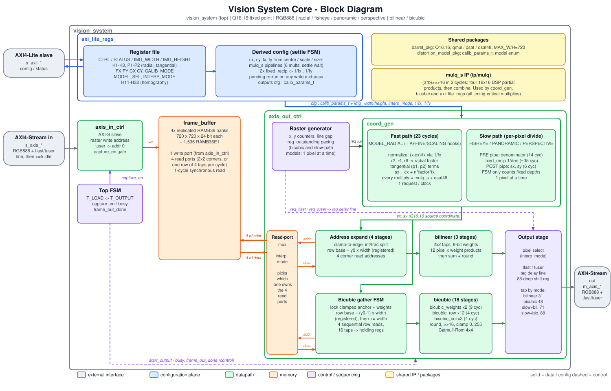

# Vision System Core

A hardware IP (100 MHz target; see "Timing closure" for how far that is actually verified) that corrects barrel/pincushion lens distortion
on a streaming video frame, with radial correction up through the **k3·r6**
term plus tangential ("plumb bob") distortion, AXI4-Stream video I/O, and
an AXI4-Lite control interface with both a simplified normalized-center
parameterization and standard pinhole camera-calibration intrinsics
(fx/fy/cx/cy). Supports two selectable interpolation modes -- bilinear
(full-rate, 1 pixel/clock) and bicubic (higher quality, slower -- see
"Interpolation modes" below) -- and a selectable distortion model:
radial (the default), a division-model fisheye and panoramic dewarp, and
a real 3x3 homography for perspective/keystone correction, each verified
with genuine synthesize-distort-then-correct image tests (see "Fisheye,
panoramic, and perspective correction"); two further models
(affine, scaling) remain reserved architecture hooks. Includes two
independent self-checking testbenches (cocotb/Python and pure
SystemVerilog) with bit-exact golden models, each running a 12-scenario
matrix: 2 distortion types x 2 interpolation modes x 3 image aspect ratios
(square/portrait/landscape), with each interpolation mode's 3 shapes
streamed as 3 consecutive frames (no reset between them) to continue
exercising the back-to-back multi-frame path -- plus a fast SystemVerilog
smoke test for the calibration/tangential/model-selector features. The
independently-reusable building blocks (`fixed_recip`, `mulq_s`,
`frame_buffer`, `ext_frame_buffer`, `coord_gen`, `bilinear`, `bicubic`) each live in their own
`ip/` subdirectory with a standalone self-checking testbench, so any one of
them can be lifted into a different project without pulling in this
project's top-level integration or AXI framing (see "Reusable IP modules").

## Block diagram

Open the [HTML documentation site](docs/site/index.html) for a browsable
overview, architecture, register map, and synthesis dashboard. Run
`make html` to refresh the dashboard from the latest synthesis summary;
`make synth` runs the existing Yosys utilization and estimated-timing flow
and refreshes the dashboard automatically.



*(`docs/block_diagram.svg` / `.png`; regenerate with `make diagram` after
editing `docs/make_block_diagram.py`.)*

Reading it left to right: an AXI4-Stream frame is written into the
4x-replicated `frame_buffer` by `axis_in_ctrl`; once the whole frame is
loaded the top FSM starts `axis_out_ctrl`, whose raster generator asks
`coord_gen` for the source coordinate of each output pixel (fast path for
radial/tangential, per-pixel-divide slow path for fisheye/panoramic/
perspective). The coordinate goes down one of two lanes -- bilinear (2x2,
one pixel per clock) or bicubic (4x4, gathered as four row reads) -- both
sharing the frame buffer's four read ports through the interpolation-mode
mux. A tag delay line re-creates `tlast`/`tuser` for the output stream.
The AXI4-Lite register file, and the derived-configuration math it runs
whenever the geometry changes, feed everything through a single
`calib_params_t` bus.

```
include/
  barrel_pkg.sv              Q16.16 fixed-point format, shared params, qmul()
  distortion_model_pkg.sv    calib_params_t struct + distortion_model_e enum

src/
  axis_in_ctrl.sv            AXI4-Stream video slave -> frame buffer
  axis_out_ctrl.sv           raster gen + coord_gen + addressing + bilinear/bicubic -> AXI4-Stream video master
  axi_lite_regs.sv           AXI4-Lite config register file
  vision_system.sv            top-level integration + selectable BRAM/SDRAM buffer

ip/
  mulq/
    src/mulq_s.sv             2-cycle pipelined 32x32 multiply; no package dependency
    tb/tb_mulq.sv             self-checking testbench (20k random + corner vectors)
    scripts/{build.f,run.sh,run_yosys.sh}
  fixed_recip/
    src/fixed_recip.sv        iterative 1/x divider -- no package dependency
    tb/tb_fixed_recip.sv      self-checking reference testbench
    scripts/{build.f,run.sh,run_yosys.sh}
  frame_buffer/
    src/frame_buffer.sv       4x-replicated full-frame BRAM store
    tb/tb_frame_buffer.sv     self-checking 4-port/read-latency test
    scripts/{build.f,run.sh,run_yosys.sh}
  ext_frame_buffer/
    src/ext_frame_buffer.sv   parameterized SDR SDRAM controller and pixel store
    tb/tb_ext_frame_buffer.sv SDRAM command/data behavioral-model test
    scripts/{build.f,run.sh,run_yosys.sh}
  coord_gen/
    src/coord_gen.sv          per-pixel coordinate-generation pipeline
    tb/tb_coord_gen.sv        independent golden-reference testbench
    scripts/{build.f,run.sh,run_yosys.sh}
  bilinear/
    src/bilinear.sv           2x2 bilinear interpolator
    tb/tb_bilinear.sv         self-checking interpolation/latency test
    scripts/{build.f,run.sh,run_yosys.sh}
  bicubic/
    src/bicubic.sv            4x4 separable Catmull-Rom interpolator
    tb/tb_bicubic.sv          self-checking interpolation/latency test
    scripts/{build.f,run.sh,run_yosys.sh}

scripts/
  build.f                    integrated top source list
  run_yosys.sh               integrated top synthesis runner

synth/
  yosys_common.ys            the shared Yosys script (xc7, BRAM + DSP mapping, hierarchical stat)
  run_all_yosys.sh           synthesize every module + timing table (synth/summary.md)
  est_timing.py              netlist-based timing estimator (explicit delay model)
  summarize.py               one-line resource summary from a utilization report
  view_waves.sh              open a VCD in the Surfer waveform viewer

ci/
  run_checked.sh             pass/fail from output markers, not just exit codes
.github/workflows/ci.yml     GitHub Actions: sim + synthesis on every push to main
Makefile                     make test-ip | test-smoke | test-sv | test-ext-sdram | test-cocotb | sim | synth | ci

tb/
  requirements.txt         Python deps for the cocotb testbench (cocotb 2.x, numpy, pillow)
  image_io.py              image I/O (Pillow) + bit-exact Python model of the RTL datapath
                            (bilinear + bicubic + camera calibration + tangential + hooks)
  test_vision_system.py   cocotb self-checking testbench: 12-scenario matrix
  test_identity.py         debug test: k=0 should reproduce the input exactly
  test_probe.py            debug test: peeks coord_gen internals vs. golden model
  scripts/run.py           builds + runs everything under Icarus Verilog
  work/                       generated simulation artifacts

tb_verilog/
  include/ppm_io_pkg.sv     binary PPM (P6) reader/writer
  include/golden_model_pkg.sv independent fixed-point golden model (bilinear + bicubic +
                            camera calibration + tangential + hooks) + coefficient fit +
                            synthetic chart generator, pure SystemVerilog
  tb_vision_system.sv  self-checking testbench: 12-scenario matrix, no Python/cocotb required
  tb_smoke.sv                fast smoke test: coord_gen calibration/tangential/hook checks
  scripts/run.sh             full 12-scenario image regression
  scripts/run_smoke.sh              builds + runs just the fast smoke test
  scripts/run_ext_sdram.sh   USE_EXT_FB integration test
  scale_verify/scripts/      large-frame verification runner
  work/                       generated simulation artifacts
```

## Reusable IP modules

`fixed_recip`, `mulq_s`, `frame_buffer`, `ext_frame_buffer`, `coord_gen`, `bilinear` and `bicubic`
are organized by role inside their `ip/<name>/` directory: synthesizable RTL
is in `src/`, testbenches are in `tb/`, and entry points are in `scripts/`.
Each `scripts/run.sh` builds and runs just that IP's testbench and is runnable
standalone (`cd ip/<name> && ./scripts/run.sh`, pure Icarus Verilog, no Python)
and prints its own PASS/FAIL summary, independent of the full 12-scenario
regression or smoke test in `tb_verilog/`.

Two of the seven (`fixed_recip` and `mulq_s`)
need no package at all; `frame_buffer` and `bilinear`/`bicubic` need only
`include/barrel_pkg.sv` (for `PIX_W`/`ADDR_W`/`qmul()` defaults, all overridable);
`ext_frame_buffer` additionally uses `include/barrel_pkg.sv` for the pixel/address
defaults and exposes a raw SDR SDRAM command/data interface.
`coord_gen` additionally needs `include/distortion_model_pkg.sv` (the
`calib_params_t` struct it takes as its one configuration port) plus the
`fixed_recip` and `mulq_s` IPs, and `bicubic` needs `mulq_s`. Both
packages live in `include/`, this project's single shared-package location --
each IP's `scripts/run.sh` reaches into `../../include/` for them rather
than duplicating a second copy, so there is exactly one source of truth
for the fixed-point format and struct layout, whether building the full
core or a single IP standalone. Pulling one of these modules into a
different project means copying its `ip/<name>/` directory plus those
one or two package files (or re-deriving equivalents locally, in which
case be careful about `qmul()`'s exact truncation/saturation semantics --
several of the bit-exact self-checks throughout this project depend on
it precisely, see "Fixed-point format" below).

Results (all pass, Icarus Verilog, no Python needed for any of these):

| IP | checks | what's covered |
|---|---|---|
| `fixed_recip` | 12/12 | powers of two, non-powers-of-two, smallest/largest operand, zero (saturate) |
| `mulq_s` | 20013/20013 | 2-cycle pipelined 32x32 multiply with the Q16.16 shift: corner values plus a 20k-vector pseudo-random sweep, exact vs. an independent 64-bit reference |
| `frame_buffer` | 1017/1017 | write-then-readback, 4-port independence, 1-cycle read latency, concurrent write(A)/read(B) |
| `ext_frame_buffer` | PASS | SDRAM initialization, queued writes, row changes, serialized four-address reads |
| `bilinear` | 12/12 | 4 corners, exact center, 3 general cases, 3-cycle pipeline latency, no bubble leak-through |
| `bicubic` | 20/20 | general case, exact-center degenerate weighting, high-contrast edge, 18-cycle pipeline latency |
| `coord_gen` | 39/39 | identity, radial, tangential, direct camera calibration, real fisheye/panoramic/perspective, remaining hooks, large-frame boundary coordinates |

### External SDRAM frame buffer

`vision_system` selects `frame_buffer` by default. Set the elaboration
parameter `.USE_EXT_FB(1'b1)` to select `ext_frame_buffer`; this exposes
`sdram_clk`, `sdram_cke`, command/address/bank/mask pins, and a bidirectional
SDRAM data bus at the top level. The default external interface is 64-bit
DQ, 13 address bits, 10 column bits, CAS latency 2, and timing counts
intended as a starting point at the project’s 100 MHz target. Override the
`SDRAM_*` parameters to match the actual device and clock.

The controller is for **single-data-rate SDR SDRAM**, not DDR. It performs
power-up initialization, row activate/precharge, single-word transfers,
write buffering, and periodic refresh. Each 24-bit pixel occupies one
SDRAM word (low bits); it serializes the four bilinear taps, so external
memory mode is deliberately paced and much slower than the BRAM backend.
Input `tready` applies backpressure while writes queue or refresh runs, and
the top waits for pending writes to drain before starting output. Bicubic
mode serializes all sixteen taps per output pixel.

The forwarded `sdram_clk` is currently the core `clk`; the RTL does not
generate a phase-shifted clock or board-specific pin constraints. Validate
clock phase, I/O timing, refresh/timing parameters, and bus width against
the exact SDRAM part and FPGA board before hardware use. Run
`make test-ext-sdram` for the behavioral-model end-to-end check.

A real bug was found building `ip/frame_buffer/tb/tb_frame_buffer.sv` -- not in
`ip/frame_buffer/src/frame_buffer.sv` itself, which was correct throughout, but in the
testbench's own signal-driving discipline. See `tb/tb_frame_buffer.sv`'s
header comment for the full account: driving DUT inputs with blocking
assignment immediately after `@(posedge clk)` races against the DUT's
own same-edge `always_ff` (Icarus resolved it by silently dropping every
other write); switching to non-blocking (`<=`) for every DUT input --
matching the convention the rest of this project already used -- fixed
it, and surfaced a second, subtler issue (reading a `<=`-driven DUT
output in the same active region before its own update commits) that
needed a small settle delay to resolve. A reminder that "the testbench
disagrees with the RTL" doesn't automatically mean the RTL is wrong.

## Running it

Four ways to exercise this design, from fastest/narrowest to
slowest/broadest:

### Individual IP testbenches (fastest, one module at a time, no Python needed)

```
cd ip/fixed_recip  && ./scripts/run.sh
cd ip/mulq         && ./scripts/run.sh
cd ip/frame_buffer && ./scripts/run.sh
cd ip/ext_frame_buffer && ./scripts/run.sh
cd ip/coord_gen    && ./scripts/run.sh
cd ip/bilinear     && ./scripts/run.sh
cd ip/bicubic      && ./scripts/run.sh
make test-ip                      # all of the above, fail-on-bad-result
make test-ext-sdram               # top-level USE_EXT_FB integration with SDRAM model
```

Add `VCD=1` to any of them to dump `waves.vcd` (and `SURFER=1` to open it --
see "Waveforms (Surfer)").

Each tests exactly one module in isolation (see "Reusable IP modules"
above for what each covers and the package dependencies involved).
Fastest option for iterating on a single module -- none of these touch
the frame-streaming pipeline at all.

### Smoke test (seconds, coord_gen only, no Python needed)

```
cd tb_verilog
./scripts/run_smoke.sh
```

Drives `coord_gen.sv` directly (not the full streaming pipeline) against
the independent golden-model reference, point by point, covering: legacy
identity, radial distortion, tangential distortion, direct
camera-calibration fx/fy/cx/cy, real fisheye/panoramic/perspective
correction math, and the two remaining reserved (MODEL_AFFINE/
MODEL_SCALING) architecture-hook gates. Use
this for a quick sanity check while iterating on `coord_gen.sv` or
`include/distortion_model_pkg.sv` -- it doesn't stream any image data, so it's
far faster than either full testbench below. (The fisheye/panoramic/
perspective hooks are additionally exercised at the full image-streaming
level by both testbenches below -- see "Verification results".)

### Full regression: two interchangeable testbenches

Both default to the **full-size** frames (480x480 / 480x720 / 720x480),
which take far too long for routine use. For everyday work and CI use small
frames (48x48 / 32x56 / 56x32): `SMALL=1 tb_verilog/scripts/run.sh`,
`SMALL_FRAMES=1 python3 tb/scripts/run.py`, or simply `make test-sv` /
`make test-cocotb` (these set them; `FULL=1 make ...` for full size).
Measured wall-clock on the development machine: ~4 minutes each at small
frames.

Both share the same RTL and the same verification strategy
(bit-exact-vs-golden-model + quality sanity check) and run the full
12-scenario image-streaming matrix. Use whichever fits your flow.

### Option A: pure Verilog (no Python/cocotb needed)

Requires only Icarus Verilog:

```
cd tb_verilog
./scripts/run.sh
```

Drop your own `test.ppm` into `tb_verilog/work/` first to correct a
specific image; otherwise a synthetic grid/circle chart is generated
automatically. Produces `tb_verilog/work/{warped,corrected}.ppm` and
prints PASS/FAIL for all four self-checks (bit-exact-vs-golden,
correction-quality, `tlast` timing, `tuser`/start-of-frame).

**PPM only.** Implementing a JPEG encoder/decoder (DCT, Huffman coding,
chroma subsampling, etc.) in Verilog is impractical and out of scope for
a hardware testbench, so this version reads/writes uncompressed binary
PPM (P6) exclusively. If you're starting from a JPEG, convert it once,
outside the simulator, e.g.:

```
convert test.jpg tb_verilog/work/test.ppm     # ImageMagick
# or
python3 -c "from PIL import Image; Image.open('test.jpg').convert('RGB').save('tb_verilog/work/test.ppm')"
```

The golden model (`golden_model_pkg.sv`) is a second, independent
SystemVerilog implementation of the same fixed-point radial-remap math
the RTL uses — not a wrapper around the RTL's own modules — so the
self-check is meaningful. The correction-coefficient fit (inverting the
synthetic distortion) is solved in closed form via a 3x3 linear system
using `real` arithmetic, since that's a one-shot testbench-side numerical
step, not part of the per-pixel hardware datapath.

### Option B: cocotb + Python (adds JPEG support)

Requires Icarus Verilog plus `cocotb`, `numpy`, `Pillow`:

```
pip install cocotb cocotb-bus pillow numpy
python3 tb/scripts/run.py
```

Drop your own `test.jpg` or `test.ppm` into `tb/work/` first if you want to
correct a specific image; otherwise the testbench generates a synthetic
grid/circle test chart automatically. The run produces
`tb/work/{warped,corrected}.{jpg,ppm}` (matching the input's extension) and
prints PASS/FAIL for both self-checks. `image_io.py` (Pillow-based) is the
Python counterpart of `golden_model_pkg.sv` -- likewise a from-scratch
reimplementation, not a wrapper around the RTL.

## Algorithm

For every output (corrected) pixel (x, y):

```
nx = (x - cx_pix) / fx_pix                ny similarly (fx_pix, fy_pix: focal
r2 = nx^2 + ny^2                           lengths in pixels -- standard
radial = 1 + k1*r2 + k2*r2^2 + k3*r2^3     pinhole camera-calibration
tang_x = 2*p1*nx*ny + p2*(r2+2*nx^2)       intrinsics; see "Camera
tang_y = p1*(r2+2*ny^2) + 2*p2*nx*ny       calibration" below)
sx = cx_pix + (nx*radial + tang_x) * fx_pix   sy similarly
output(x,y) = interpolate(input, sx, sy)   -- bilinear or bicubic
```

p1/p2 (tangential, "plumb bob" distortion) default to 0, in which case
this reduces to the original pure-radial equation. `k1 < 0` pulls samples
inward at the edges, correcting the common "barrel"/fisheye bulge; `k1 >
0` corrects pincushion distortion.

**Sign convention, verified empirically** (not just assumed from
textbook convention, since this primitive's "which side is source vs.
output" framing could plausibly go either way): applying this exact
remap primitive with **positive** k1 to a flat/undistorted test image
produces genuine barrel bulge — straight lines bow outward, corners get
pinched/clipped, classic fisheye look. Applying **negative** k1 to that
barrel-bulged image pulls it back toward flat. This matches the AXI-Lite
register documentation above (`k1<0` corrects barrel) and is exactly the
convention both testbenches use: they synthesize `warped.*` with
`k1=+0.08` (genuine barrel) and fit negative correction coefficients to
undo it. See `tb/test_vision_system.py` / `tb_verilog/tb_vision_system.sv`
for the exact values, and their inline comments for why the sign matters.

Because this is a **global** 2-D remap (not a local filter), an output row
can require input data from anywhere in the frame — there is no way to do
this with a handful of line buffers. The design therefore buffers the
*whole* input frame before generating any output.

## Camera calibration

`CALIB_MODE` (AXI-Lite 0x30) selects how `coord_gen`'s pinhole
normalization (`nx = (x-cx_pix)/fx_pix`) is parameterized:

- **`CALIB_MODE=0`** (default, backward compatible): `cx_pix`/`cy_pix`/
  `fx_pix`/`fy_pix` are **derived** from CENTER_X/CENTER_Y (fraction of
  frame width/height) and SCALE (uniform edge-crop zoom) combined with
  IMG_WIDTH/IMG_HEIGHT -- exactly the parameterization this design used
  before CALIB_MODE existed. Convenient for "center of the frame, zoom
  factor" use, and what all of this project's automated tests still use.
- **`CALIB_MODE=1`**: `cx_pix`/`cy_pix`/`fx_pix`/`fy_pix` are taken
  **directly**, in pixels, from the FX/FY/CX/CY registers -- the standard
  pinhole camera intrinsic-matrix convention used by calibration tools
  (e.g. OpenCV's `cv2.calibrateCamera`, whose `camera_matrix` diagonal and
  last column are exactly `[[fx,0,cx],[0,fy,cy],[0,0,1]]`). Point a real
  lens/sensor's measured intrinsics straight at these four registers,
  together with its measured k1/k2/k3/p1/p2 distortion coefficients
  (also standard OpenCV `distCoeffs` output), with no unit conversion.

Both modes feed the exact same downstream math (`coord_gen.sv` has no
idea which one produced its `cfg.fx_pix` etc.) -- CALIB_MODE only changes
where those four numbers come from.

## Reusable structure

Every per-frame parameter `coord_gen.sv` needs -- calibration intrinsics,
radial and tangential distortion coefficients, and the model selector --
is bundled into one packed struct, `calib_params_t` (`include/distortion_model_pkg.sv`),
passed as a single port rather than a dozen individual scalar ports. This
is what makes the pipeline **reusable**: extending it with a new model's
parameters (see "Extension hooks" below) is a struct-field addition, not
a port-list change that has to be propagated through `axis_out_ctrl.sv`,
`vision_system.sv`, and `axi_lite_regs.sv` every time. The
same package also holds `distortion_model_e`, the model-selector enum.

## Fisheye, panoramic, and perspective correction

`MODEL_SEL` (AXI-Lite 0x4C, `distortion_model_e` in `include/distortion_model_pkg.sv`)
selects which projection `coord_gen.sv` applies. Four of the six are
implemented: `MODEL_RADIAL` (above), and now `MODEL_FISHEYE`,
`MODEL_PANORAMIC`, and `MODEL_PERSPECTIVE` too. `MODEL_AFFINE` and
`MODEL_SCALING` remain reserved architecture hooks (see below);
selecting either still falls back to an exact identity round-trip,
verified by the smoke test.

**Fisheye and panoramic (division model).** Rather than the
trigonometric equidistant fisheye model (`r_d=f*atan(r_u/f)`, which needs
`atan`/`tan` hardware this design doesn't have -- CORDIC or a LUT would
be the usual answer), `MODEL_FISHEYE` uses Fitzgibbon's *division model*,
a well-established trig-free alternative that reuses the K1/K2 registers
already in place for the radial model, just as a divisor instead of a
multiplier:
```
denom = 1 + k1*r^2 + k2*r^4
nx' = nx / denom   ;   ny' = ny / denom
```
This can represent much more severe distortion than a same-order
multiplicative polynomial, which is exactly why it's a standard choice
for wide-angle lenses in practice. `MODEL_PANORAMIC` applies the same
idea horizontally only (reusing K1 alone) -- a documented approximation
of cylindrical dewarp, not full equirectangular-to-rectilinear
reprojection (which needs multiple trig calls this design still doesn't
have):
```
denom = 1 + k1*nx^2   ;   nx' = nx/denom   ;   ny' = ny (unchanged)
```

**Perspective (3x3 homography).** Genuine keystone correction, operating
directly on pixel coordinates (not normalized against a focal length --
homography conventionally isn't) via 8 new registers H11-H32 (`h33` fixed
at 1.0, since a homography is only defined up to overall scale):
```
denom = h31*x + h32*y + 1
sx = (h11*x + h12*y + h13) / denom
sy = (h21*x + h22*y + h23) / denom
```
Identity: `h11=h22=1`, everything else 0 (the reset default).

**The "slow path".** All three need a genuine per-pixel reciprocal
divide -- something this design previously only did once per *frame*, in
the config plane (`fixed_recip.sv`, used to derive `1/fx_pix` etc.).
`coord_gen.sv` now has a second internal FSM (its "slow path": states
`SD_IDLE -> SD_ISSUE -> SD_WAIT -> SD_DONE`) that instantiates a second
`fixed_recip` and runs it once per pixel for these three models only --
`MODEL_RADIAL` (and the `MODEL_AFFINE`/`MODEL_SCALING` hooks) stay on the
original always-flowing, fixed-latency (now 23-cycle) path, completely
untouched. The slow path's own latency was **measured directly, not
guessed**: originally 38 cycles from request to result inside `coord_gen`
alone, 43 end-to-end with bilinear downstream, 49 with bicubic downstream;
after the timing work (`coord_gen`'s slow path is now a free-running pre-
pipeline -> divider -> post-pipeline) they are 71 and 88 end-to-end
(see `axis_out_ctrl.sv`'s tag-delay-line comment for the measurement
methodology, the same discipline the bicubic-latency bug earlier in this
project's history established). `coord_gen`'s new `busy` output paces the
raster generator exactly the way bicubic mode already paced it for its
own downstream latency -- extended, not duplicated (`axis_out_ctrl.sv`'s
`req_outstanding`/`need_pacing` logic now covers both reasons a request
might take longer than 1 cycle).

Correcting a real fisheye/panoramic image means fitting K1(/K2) so that
applying the division model a second time (once forward to distort,
once as the "correction") measurably undoes the first application --
the division model isn't linear in its coefficients, so this project's
testbenches use a small grid search (`fit_division_model_coeffs` in
`golden_model_pkg.sv`) rather than the radial model's closed-form
least-squares fit. Perspective correction, by contrast, has an *exact*
answer: the correcting homography is the forward homography's matrix
inverse, computed in closed form (`invert_homography`, cofactor/adjugate
method).

## Remaining architecture hooks: MODEL_AFFINE, MODEL_SCALING

What these two would need to become real:

- **`MODEL_AFFINE`** -- a general 2x3 affine transform (`sx = a*x+b*y+c`,
  `sy = d*x+e*y+f`). The cheapest of the two: six new Q16.16 registers
  (a-f) added to `calib_params_t`, and stage 8's
  `cx_pix + qmul(sxn,fx_pix)` replaced with the two-term affine sum
  directly on `(x,y)` -- no normalize/denormalize round-trip needed at
  all, so this could bypass most of the existing fast-path pipeline
  stages, and (unlike fisheye/panoramic/perspective) needs no divide, so
  it could stay on the fast, always-flowing path rather than needing the
  slow path at all.
- **`MODEL_SCALING`** -- arbitrary non-uniform resize/crop
  (`sx = x*scale_x + offset_x`, `sy` similarly). Simplest of the two: a
  direct affine special-case (`MODEL_AFFINE` with `b=d=0`), so once
  `MODEL_AFFINE` exists this could be implemented in the testbench/driver
  layer alone by configuring the affine coefficients appropriately,
  without needing separate RTL support at all.

## Interpolation modes

`INTERP_MODE` (AXI-Lite 0x2C) selects between two interpolation modes,
applied to whichever fractional source coordinate `coord_gen` computes —
**`coord_gen` itself is completely unchanged between the two modes**; only
how far the tap footprint is expanded, and how many memory-read cycles it
costs, differs downstream in `axis_out_ctrl.sv`. The mode must be held
static for the duration of a frame (changing it mid-frame is not
supported — set it before `IMG_WIDTH`/`IMG_HEIGHT`/starting a frame).

- **Bilinear (`INTERP_MODE=0`, default)**: the original 2x2-tap datapath.
  Fully pipelined, never stalls, sustains **1 output pixel/clock**, fixed
  13-cycle latency. Reproduces the exact same "line, then 5 idle cycles"
  timing at the output as at the input.
- **Bicubic (`INTERP_MODE=1`)**: a 4x4-tap separable Catmull-Rom filter
  (`bicubic.sv`, a=-0.5, the same kernel OpenCV's default bicubic uses).
  Weights: `w(-1)=-0.5t³+t²-0.5t`, `w(0)=1.5t³-2.5t²+1`,
  `w(+1)=-1.5t³+2t²+0.5t`, `w(+2)=0.5t³-0.5t²` (sum to 1.0 for any t —
  partition of unity). Higher quality (less blur, sharper edges) than
  bilinear, at a real throughput cost explained below.

### The throughput/timing trade-off (bicubic is NOT full-rate)

`frame_buffer.sv` has only four read ports, sized for bilinear's 2x2
footprint. Rather than replicating the memory sixteen-fold to give
bicubic's 4x4 footprint the same single-cycle access, this design reuses
the existing four ports and gathers the 4x4 footprint as **four
sequential row-reads** (one row of 4 taps per cycle). This is a
deliberate area/throughput trade-off for a reference design reusing a
bilinear-sized memory system — a production design targeting bicubic at
full rate would size the frame buffer with 16 read ports (or use an
external-memory tile cache) instead.

The consequence: bicubic mode processes **one pixel at a time** — the
raster generator only issues a new source-coordinate request once the
previous pixel's result has fully emerged (a `req_outstanding` handshake
in `axis_out_ctrl.sv`; `coord_gen` sees the resulting sparse request
stream as ordinary bubbles, exactly like the existing line-gap idle
cycles it already tolerates, so it needed no changes at all). Measured
end-to-end latency per pixel: coord_gen(23) + the gather FSM (lock anchor,
registered row-base multiply, four sequential row-reads) + bicubic.sv's own
18-stage pipeline = **48 cycles/pixel** (measured; it was 19 before the
timing-closure work -- see "Pipeline / timing", and "A real bug found"
below for why these numbers are always measured, never hand-derived). Bicubic mode
therefore does **not** reproduce the input's "line, then 5 idle" timing
at the output — the output runs much slower and with different (also
measured, not guessed) internal gaps. This is an honest, documented
trade-off, not an oversight.

## Fixed-point format

Every arithmetic value in the design (coefficients, coordinates, factors)
is a **signed Q16.16** word (32 bits: 16 integer bits including sign, 16
fractional bits, resolution 2^-16 ≈ 1.5e-5). One format used everywhere
means one multiply primitive (`barrel_pkg::qmul`: 32x32→64 signed multiply,
arithmetic right-shift by 16, saturate to 32 bits) is reused at every
pipeline stage — no per-signal bit-width bookkeeping, no room for
format-mismatch bugs.

Division (needed once, to get `1/(halfW*scale)` and `1/(halfH*scale)`) is
kept **entirely off the per-pixel critical path**: `fixed_recip.sv` is a
33-cycle iterative shift/subtract divider that runs only when geometry
registers are (re)written, producing a reciprocal that the per-pixel
pipeline then just multiplies by. There is no divider anywhere in the
per-pixel datapath.

## Pipeline / timing

Latencies below are the **current** values (after the timing-closure work,
next section) and are **measured in simulation**, not derived by hand --
`axis_out_ctrl.sv`'s four `TOTAL_LATENCY_*` constants drive the tlast/tuser
tag delay line, and the regression's tlast/tuser timing checks fail if any
of them is off by even one.

**Bilinear mode:**
- `coord_gen`: 23-stage feed-forward pipeline, one new (x,y) request
  accepted every clock.
- address-expand (integer/fraction split + clamp-to-edge, `y0*width`
  row-base multiply, row-base add, four corner addresses): 4 cycles.
- `frame_buffer` synchronous read: +1 cycle.
- `bilinear`: 3-stage pipeline (weights; the 12 pixel*weight products;
  sum/round/select).
- **Total pipeline latency: 31 cycles**, request to output pixel, fully
  pipelined at 1 pixel/clock.

The bilinear datapath is feed-forward and never stalls once it starts (no
backpressure capability mid-pipeline -- see Limitations). Because of that,
whatever valid/idle pattern is fed into the request side reappears
identically at the output, 31 cycles later. `axis_out_ctrl` exploits this
directly: it generates the output raster with the *same* "W cycles valid,
then 5 idle cycles" timing the input used, and the correct output timing
falls out for free rather than needing to be reconstructed afterwards.

**Bicubic mode:** one pixel processed at a time (see "Interpolation modes"
for why): coord_gen (23) + the gather FSM (lock anchor, registered row-base
multiply, four sequential row reads) + `bicubic.sv`'s own 18-stage
pipeline = **48 cycles/pixel**.

**Slow-path models (fisheye / panoramic / perspective):** coord_gen's
per-pixel-divide path replaces its 23-cycle fast latency, giving **71**
cycles/pixel (bilinear downstream) and **88** (bicubic downstream).

| mode | total latency (cycles) |
|---|---|
| bilinear, radial (fast path) | 31 |
| bicubic, radial (fast path) | 48 |
| bilinear, fisheye/panoramic/perspective | 71 |
| bicubic, fisheye/panoramic/perspective | 88 |

**Throughput consequence.** Only bilinear + a fast-path model sustains one
pixel per clock; bicubic and the slow-path models process one pixel at a
time (this was already true -- the timing work only lengthened each
pixel's latency, roughly 2-3x). The simulation throughput figures quoted
in "Large-frame verification" below (345 / 161 pixels/sec) were measured on
the earlier, shallower pipeline; every mode is now slower to simulate.

## Timing closure (pipeline updates)

The design was originally documented as closing 100 MHz "comfortably ...
on any modern FPGA". Measuring it showed that was **wrong**. With
`synth/est_timing.py` (below) run on the Yosys netlist, the worst
register-to-register paths against a 10 ns clock were:

| module | before | after | what changed |
|---|---|---|---|
| `bilinear` | 10.2 ns | 7.75 ns | products and the 4-way sum moved to separate stages |
| `bicubic` | 28.8 ns | 6.15 ns (7.2 in `mulq_s`) | every multiply split via `mulq_s`; row/column filters staged |
| `coord_gen` | 48.5 ns | 6.5 ns (7.2 in `mulq_s`) | every multiply via `mulq_s`; slow path restructured (below) |
| `axi_lite_regs` | 14.7 ns | 3.1 ns | config-plane `qmul()` chains moved to `mulq_s` pipelines |
| address generation -> BRAM | 12.9 ns | (in 8.2 ns top) | row-base multiply registered; later rows by adding `width` |
| **whole design, flattened** | 12.9 ns | **8.2 ns** | |

Root causes, in the order they were found:

1. **Every `qmul` put a 32x32 multiply, the >>16, the saturation compare and
   often an add in one cycle.** Yosys builds a 32x32 multiply from four
   DSP48E1s (25x18) whose partial products are summed in *fabric* adders
   before reaching the product register -- ~11 ns even with registered
   operands (measured on a 5-line micro-module). The saturate stage alone
   is only 2.5-6.6 ns.
2. **Async-reset datapath registers** (`FDCE` + one `INV` each; 5,978 `INV`
   cells at the top level originally) cannot be absorbed into DSP-internal
   registers. Data registers now have no reset; only valid bits do.
3. **The slow path computed its denominator combinationally** -- five
   chained 32x32 multiplies in one cycle (the 48 ns path). It is now a
   free-running pre-pipeline -> `fixed_recip` -> post-pipeline; the FSM
   only counts fixed depths, because the latched request coordinates are
   held for the whole operation.
4. **Paths that cross module boundaries** (e.g. `img_width` register ->
   row-base multiply -> BRAM address) are invisible to a per-module view.
   The flow now also writes a *flattened* netlist and the estimator treats
   BRAM pins as endpoints (address setup 0.8 ns, clk->out 2.0 ns).

**The fix, `ip/mulq/src/mulq_s.sv`.** A signed 32x32 multiply that returns
exactly `(a*b) >>> 16` (48-bit) in 2 cycles: four 16x16 partial products
(one DSP each; Yosys absorbs their register as `MREG`) combined in the second
stage using `(a*b)>>>16 = ah*bh*2^16 + (ah*bl+al*bh) + floor(al*bl/2^16)`
(exact, because the low half is unsigned). `barrel_pkg::qsat48()` then
saturates it, so `qsat48(mulq_s(a,b)) == qmul(a,b)` for **all** inputs --
verified on 20,013 vectors and, more importantly, by every bit-exact
image-level check in both testbenches passing unchanged.

**Bit-exactness was preserved throughout** -- only registers were added, so
only latencies changed; the golden models were not touched.

**Two bugs found on the way** (both in my own edits, both caught by the
existing checks): (a) a Verilog part-select is *unsigned*, so
`r[31:0] * w` silently became an unsigned multiply where the original had
passed the value through `qmul`'s signed port -- caught by `tb_bicubic`;
(b) a first `mulq_s` testbench drove inputs with blocking assignments at the
clock edge and reported a spurious 50% mismatch rate -- a testbench race,
not an RTL bug (fixed with the non-blocking `drive` task).

**Costs, honestly.**
- *Latency* grew ~2.4x per pixel (table above).
- *DSP48E1 count grew*: bicubic 172 -> 224, coord_gen 152 -> 156, top-level
  355 -> 423, because a 32x32 multiply is now four explicit 16x16 DSPs. Many
  of those multiplies have a constant operand (the Catmull-Rom weight
  constants 0.5/1.5/2.5/2/-1.5); replacing them with shift-add would save
  roughly 60-70 DSPs but is bit-exact only for the documented
  0 <= t < 1 input range, so it was left as a follow-up rather than done
  silently.
- The estimate is a **proxy**, not Vivado STA: no placement, no routing, an
  editable delay model (`synth/est_timing.py`, header comment). Treat
  "MET at 10 ns" as "no structural violation found", and expect real
  numbers to differ. Constant/static configuration registers (like
  `img_width`) are timed as if they toggle every cycle, which is
  pessimistic.

## Synthesis with Yosys (Xilinx 7-series)

Every IP directory (`ip/fixed_recip`, `ip/mulq`, `ip/frame_buffer`,
`ip/ext_frame_buffer`, `ip/bilinear`, `ip/bicubic`, `ip/coord_gen`) has its
own synthesis manifest and runner. The integrated top uses `scripts/build.f`
and `scripts/run_yosys.sh`:

- `scripts/build.f` -- the RTL file list for that module, in dependency order
  (packages first), `#` comments allowed;
- `scripts/run_yosys.sh` -- reads the manifest, runs Yosys, writes everything to that
  directory's `yosys/` subdirectory, and prints a one-line resource summary.

All of them execute the same shared script, `synth/yosys_common.ys`:
`hierarchy -check -auto-top` -> `synth_xilinx -family xc7` (proc/opt/fsm,
**memories mapped to BRAM** and **multiplies packed into DSP48E1**, both
default-on, only disabled by `-nobram`/`-nodsp`; hierarchy kept, since
flattening is opt-in) -> `stat` for the **hierarchical utilization report**
-> netlist writes. Results in each `yosys/`:

| file | contents |
|---|---|
| `yosys.log` | full Yosys log |
| `utilization_hier.rpt` | per-module cell counts plus the rolled-up "design hierarchy" total |
| `synth_netlist.v` / `.json` | hierarchical mapped netlist |
| `synth_netlist_flat.json` | flattened copy, used only for timing estimation |

```
cd ip/coord_gen && ./scripts/run_yosys.sh     # one module
make synth                            # all eight + timing table -> synth/summary.md
CLOCK_NS=8 synth/run_all_yosys.sh     # tighter timing target
```

`make synth` (i.e. `synth/run_all_yosys.sh`) writes `synth/summary.md` and
**exits non-zero if any module has negative estimated slack**, which is
what CI gates on. Current results (Yosys 0.69+154, xc7, 10 ns target):

| module | LUT | FF | DSP48E1 | RAMB36 | SRL | est. worst path | slack |
|---|---|---|---|---|---|---|---|
| `fixed_recip` | 175 | 141 | 0 | 0 | 0 | 4.65 ns | 5.35 |
| `mulq_s` | 48 | 48 | 4 | 0 | 0 | 7.20 ns | 2.80 |
| `frame_buffer` | 296 | 12 | 0 | **1536** | 0 | 2.80 ns | 7.20 |
| `ext_frame_buffer` | 937 | 1714 | 0 | 0 | 0 | 5.75 ns | 4.25 |
| `bilinear` | 0 | 27 | 16 | 0 | 0 | 7.75 ns | 2.25 |
| `bicubic` | 4992 | 3818 | 224 | 0 | 704 | 7.20 ns | 2.80 |
| `coord_gen` | 4815 | 3338 | 156 | 0 | 380 | 7.20 ns | 2.80 |
| **top level (`src/`)** | 12194 | 9943 | **423** | **1536** | 1100 | **8.20 ns** | 1.80 |

Two numbers deserve a plain statement:

- **1,536 RAMB36E1.** `frame_buffer` is sized for `MAX_W x MAX_H = 720x720`
  x 24 bit x 4 replicated banks (the 4-way replication is what gives
  single-cycle 2x2 reads). That is more block RAM than most 7-series
  devices have (only the largest Virtex-7 parts). The frame buffer is a
  reference on-chip implementation. The optional `ext_frame_buffer`
  backend stores pixels in external SDR SDRAM without a tile cache and
  serializes sampling, so it trades throughput for capacity; its raw pins
  and board-timing caveats are described under "External SDRAM frame
  buffer". `MAX_W/MAX_H` in `include/barrel_pkg.sv` can be reduced for a smaller
  target.
- **423 DSP48E1 at the top level** exceeds e.g. an Artix-7 100T (240). See
  "Timing closure" for why it grew and the identified way to shrink it.

### Yosys portability rules (what the RTL now obeys, and why)

Open-source Yosys 0.33's Verilog frontend accepts only a *subset* of
SystemVerilog. Every rule below was found by reproducing the failure in a
minimal file, and the RTL was changed to comply (the simulator, Icarus,
accepts both forms, so none of this changes simulated behaviour -- the full
regression was re-run after each batch):

1. **No `return` in functions** -- assign to the function name instead.
2. **No file-scope `import pkg::*;`** before a module (nor in the module
   header, in this version) -- qualify every package reference
   (`barrel_pkg::PIX_W`, `distortion_model_pkg::MODEL_RADIAL`). Local
   parameters that shadow a package name still work unqualified.
3. **Package struct/enum types in port lists must be qualified**
   (`input distortion_model_pkg::calib_params_t cfg`).
4. **No struct-typed function arguments** ("failed to resolve identifier for
   width detection") -- pass the individual fields.
5. **No `pkg::type'(expr)` casts** -- a plain assignment converts the same bits.
6. **Signed casts / signed function results used directly as a module
   port-connection expression crash Yosys** (`Assert arg->is_signed ==
   sig.as_wire()->is_signed`): `.a($signed(x))`, `.operand($unsigned(f(x)))`.
   Declare an intermediate wire of the right signedness and connect that.
7. **No packed multi-dimensional arrays** (`logic [1:0][31:0] x`) -- use flat
   vectors or small helper modules instantiated from a `generate` loop
   (which is how `bicubic.sv` is organised).

A related simulator-side trap worth knowing: a Verilog **part-select is
always unsigned** (`r[31:0] * w` is an unsigned multiply); wrap it in
`$signed()` where signed arithmetic is intended.

## Waveforms (Surfer)

Every testbench can dump a VCD, and `synth/view_waves.sh` opens it in the
[Surfer](https://surfer-project.org) waveform viewer:

```
cd ip/bicubic && VCD=1 ./scripts/run.sh                  # writes ip/bicubic/waves.vcd
cd ip/bicubic && VCD=1 SURFER=1 ./scripts/run.sh         # ... and opens it in Surfer
synth/view_waves.sh ip/bicubic/waves.vcd         # open an existing file
SMALL=1 VCD=1 tb_verilog/scripts/run.sh                  # -> tb_verilog/work/waves.vcd
WAVES=1 SMALL_FRAMES=1 python3 tb/scripts/run.py         # cocotb waveform (sim_build/)
```

The testbenches use a guarded `` `ifdef DUMP_VCD `` block, so normal runs
pay nothing. The whole-design regression records only the first
`VCD_WINDOW_NS` (default 300,000 ns; override with `-DVCD_WINDOW_NS=`)
because a full multi-frame run would produce an unmanageably large file.
If `surfer` is not on `PATH` the script prints install options (release
binary, `cargo install`, or the in-browser viewer) and the VCD path -- any
VCD viewer works with the files. (`view_waves.sh` was tested with a
stand-in `surfer` executable; the GUI itself is not runnable in the
headless environment used to build this.)

## Code coverage

`make cov` runs `test-ip`, `test-smoke`, `test-sv`, and `test-ext-sdram`
through `../../ip/scripts/run_cov.sh`, which rebuilds each Icarus compile
with `verilator --coverage` and writes a per-RTL-file summary (line,
branch, expression, toggle) to `build/coverage/summary.txt`, plus LCOV
(`coverage.info`) and annotated sources (`annotated/`). The cocotb
regression is not included: it needs Icarus VPI. `FULL=1` applies as usual.

## Continuous integration (GitHub Actions)

`.github/workflows/ci.yml` runs on **every push to `main`** (and on manual
dispatch) as four parallel jobs, each just a `make` target:

| job | command | what it checks |
|---|---|---|
| Simulation - IP + smoke | `make test-ip test-smoke` | six standalone IP testbenches + coord_gen smoke test |
| Simulation - SystemVerilog | `make test-sv` | 12-scenario matrix + fisheye/panoramic/perspective, bit-exact vs. golden model |
| Simulation - cocotb | `make test-cocotb` | the same via cocotb/Python |
| Synthesis | `make synth` | Yosys for all seven modules; **fails on estimated timing violation** |

- Tests fail on a bad *result*, not just a bad exit code: `vvp` exits 0
  even when a testbench prints FAIL, so `ci/run_checked.sh` requires the
  PASS marker and rejects FAIL markers. This was verified by injecting a
  functional bug, a compile error, and a timing violation -- each made
  the gate fail.
- CI uses **small frames** (48x48 / 32x56 / 56x32; `SMALL=1`,
  `SMALL_FRAMES=1`); the 480x480/480x720/720x480 sets take hours. Run the
  workflow manually with **full_frames** to use them, or **waves** to dump
  and upload VCDs (open them with Surfer).
- Logs (`ci/logs/`), generated images, synthesis reports
  (`yosys/`, `synth/summary.md`) are uploaded as artifacts; the synthesis
  table is also shown in the job summary.
- Runner: `ubuntu-latest` by default (Ubuntu 24.04: `apt` provides
  Icarus 12.0 and Yosys 0.33, the exact versions this project was
  developed with). To use a **self-hosted runner**, set the repository
  variable `CI_RUNNER_LABELS` to a JSON array of labels, e.g.
  `["self-hosted","linux"]`; the tool-install steps are skipped when the
  tools already exist. To also run on pull requests, add
  `pull_request:` under `on:`.
- The whole flow was verified locally from a *fresh clone* of a scratch
  git repository (commit, clone, run the same `make` targets), which
  catches missing/untracked files. The workflow YAML was parsed and
  structure-checked, but **it has not been executed on GitHub** -- this
  environment cannot reach GitHub Actions.

Local equivalents: `make sim`, `make synth`, `make ci` (see the Makefile
header), `FULL=1` for full-size frames, `make clean`.

## AXI4-Stream interfaces

Both `s_axis_*` (video in) and `m_axis_*` (video out) use: `tdata[23:0]`
= packed RGB888, `tlast` = last pixel of a line, `tuser` = first pixel of
the frame. Per the spec, each line is `IMG_WIDTH` back-to-back beats
followed by **5 idle cycles** before the next line.

`m_axis_tready` is expected to be held high throughout — this is a
fixed-rate video pipeline with no internal stall capability (see
Limitations).

## AXI4-Lite register map

32-bit registers, word-aligned:

| Offset | Name       | Access | Description |
|--------|------------|--------|-------------|
| 0x00   | CTRL       | -      | reserved |
| 0x04   | STATUS     | RO     | bit0 busy, bit1 frame_done (sticky, W1C), bit2 recip_busy |
| 0x08   | IMG_WIDTH  | RW     | active frame width, 1..MAX_W (default 512) |
| 0x0C   | IMG_HEIGHT | RW     | active frame height, 1..MAX_H (default 512) |
| 0x10   | K1         | RW     | signed Q16.16, r^2 coefficient |
| 0x14   | K2         | RW     | signed Q16.16, r^4 coefficient |
| 0x18   | K3         | RW     | signed Q16.16, r^6 coefficient |
| 0x1C   | CENTER_X   | RW     | unsigned Q16.16, fraction of width (0.5 = 0x00008000) |
| 0x20   | CENTER_Y   | RW     | unsigned Q16.16, fraction of height |
| 0x24   | SCALE      | RW     | unsigned Q16.16, edge-crop zoom (1.0 = 0x00010000) |
| 0x28   | VERSION    | RO     | 0x00010000 |
| 0x2C   | INTERP_MODE| RW     | bit0: 0=bilinear (default), 1=bicubic. Static per frame -- do not change mid-frame. |
| 0x30   | CALIB_MODE | RW     | bit0: 0=legacy normalized center+scale (default), 1=direct camera calibration (use FX/FY/CX/CY below instead of CENTER_X/CENTER_Y/SCALE) |
| 0x34   | FX         | RW     | signed Q16.16 pixels, focal length X. Used only when CALIB_MODE=1. |
| 0x38   | FY         | RW     | signed Q16.16 pixels, focal length Y. Used only when CALIB_MODE=1. |
| 0x3C   | CX         | RW     | signed Q16.16 pixels, principal point X. Used only when CALIB_MODE=1. |
| 0x40   | CY         | RW     | signed Q16.16 pixels, principal point Y. Used only when CALIB_MODE=1. |
| 0x44   | P1         | RW     | signed Q16.16, tangential distortion coefficient 1. Applied only when MODEL_SEL=RADIAL (default). |
| 0x48   | P2         | RW     | signed Q16.16, tangential distortion coefficient 2. Applied only when MODEL_SEL=RADIAL. |
| 0x4C   | MODEL_SEL  | RW     | bits[2:0]: 0=RADIAL, 1=FISHEYE, 2=AFFINE (hook), 3=PERSPECTIVE, 4=SCALING (hook), 5=PANORAMIC -- RADIAL/FISHEYE/PERSPECTIVE/PANORAMIC implemented; AFFINE/SCALING are reserved architecture hooks. See "Fisheye, panoramic, and perspective correction" below. Static per frame. |
| 0x50   | H11        | RW     | signed Q16.16. MODEL_PERSPECTIVE homography coefficient. Default 1.0 (identity). |
| 0x54   | H12        | RW     | signed Q16.16. Default 0. |
| 0x58   | H13        | RW     | signed Q16.16, pixels (translation). Default 0. |
| 0x5C   | H21        | RW     | signed Q16.16. Default 0. |
| 0x60   | H22        | RW     | signed Q16.16. Default 1.0 (identity). |
| 0x64   | H23        | RW     | signed Q16.16, pixels (translation). Default 0. |
| 0x68   | H31        | RW     | signed Q16.16. Default 0. |
| 0x6C   | H32        | RW     | signed Q16.16. Default 0. (H33 implicit = 1.0.) |

Writing IMG_WIDTH, IMG_HEIGHT, CENTER_X, CENTER_Y, SCALE, CALIB_MODE, FX,
FY, CX or CY automatically (re)triggers the reciprocal recompute (same
mechanism, extended); K1-K3, P1, P2 and MODEL_SEL take effect immediately
on the next output frame without a recompute pass, exactly like K1-K3
already did.

Writing `IMG_WIDTH`, `IMG_HEIGHT`, `CENTER_X`, `CENTER_Y` or `SCALE`
automatically retriggers the derived-config recompute (pixel-domain
center, half-width/height, and their reciprocals). Poll
`STATUS.recip_busy` (bit 2) until clear before starting a frame after
changing any of these. K1/K2/K3 can be written at any time (no recompute
needed).

## A real bug found & fixed during bring-up

*(Historical account. The cycle counts quoted in this section -- 13, 18,
19 -- were correct for the design at the time; the timing-closure work
later changed them to 31 and 48 and the same measure-don't-derive
discipline was used to re-establish them. See "Pipeline / timing".)*


Bring-up on the full test image initially produced a badly-shifted,
wrong output despite `fixed_recip` and `coord_gen` each passing isolated
unit tests. Root cause, found by probing `coord_gen`'s internal output
directly against the golden model: the derived-config recompute (`cx_pix`,
`halfW*scale`, the two reciprocals) took ~66 cycles, and if a second
geometry-affecting register (e.g. `IMG_WIDTH` right after `CENTER_X`) was
written while that recompute was still in flight, the second trigger was
silently dropped — the core would run a whole frame against a **stale**
width/height (the register write itself succeeded; only the derived-value
recompute didn't re-fire). Fixed with a `pending` latch in
`axi_lite_regs.sv`: any write during a busy recompute now guarantees
another pass runs immediately afterward, using the registers' final
settled values, so no write is ever lost. `test_probe.py` is kept in the
repo as the regression test that caught this.

A second, smaller bug: the clamp-to-edge logic at the last row/column
clamped the integer sample index but left the bilinear fraction
unchanged, systematically pulling the very last row/column 1 pixel short.
Fixed by forcing the fraction to 0/255 (full weight to the correct edge
pixel) whenever the corresponding index is clamped. `test_identity.py`
(k=0 should reproduce the input exactly) is kept as the regression test
for this.

A third issue, found from a user review rather than simulation: the
testbenches' *synthetic test-image generator* (not the RTL) had the sign
of its distortion coefficient backwards -- it was labeled as producing
"barrel" distortion but visually produced pincushion distortion instead
(confirmed by rendering a plain grid through it: lines curved inward
toward the center, not outward). Verified empirically (not just
reasoned about) which sign actually produces barrel bulge, then fixed
the testbenches' `kd1` sign. The RTL and its AXI-Lite register
documentation were unaffected -- `k1<0` genuinely does correct barrel
bulge, as documented; only the test data generation was wrong. See the
"Sign convention" note under Algorithm above.

A fourth bug, a real RTL bug this time, was found once the testbenches
were extended to stream multiple consecutive frames without a reset
between them (exactly the back-to-back multi-frame testing this project
was later extended to do more of): `axis_in_ctrl.sv`'s write address was
`assign wr_addr = addr_cnt;`, and on the `tuser` (first-pixel-of-frame)
beat, `addr_cnt` still held the stale value left over from the *end* of
the previous frame -- correct only on the very first frame after a global
reset. This corrupted frame-buffer address 0 (and a small cluster of
pixels referencing it via clamp-to-edge) on every 2nd-and-later
consecutive frame. Confirmed via isolated diagnostic: pincushion alone
from a fresh reset gave 0 mismatches; pincushion run immediately after
barrel (same simulation, no reset) gave 49 max_err / 129 mismatches;
adding a 100-cycle settle delay between the two frames changed nothing
(ruling out a timing race, confirming it was the stale-address latch).
Fixed with `assign wr_addr = (wr_en && s_axis_tuser) ? '0 : addr_cnt;`.
This bug could only ever manifest when processing 2+ frames
continuously -- it's a direct example of why this project keeps
expanding to genuinely multi-frame, multi-shape testing rather than
stopping at "one frame passes."

A fifth issue, found while adding bicubic mode: the bicubic gather FSM's
total per-pixel latency was initially hand-derived as 18 cycles
(coord_gen 9 + four gather-read cycles 4 + bicubic.sv's 5-stage pipeline
5) and the `tlast`/`tuser` tag-delay shift register was sized to match.
Bit-exact pixel-value checks passed regardless (they don't depend on the
tag-delay depth at all), but `tlast`/`tuser` protocol checks failed in
bicubic mode. Root cause: the hand-count missed that the gather FSM's
handoff pulse to `bicubic.sv` (`bc_gather_valid`) is itself a
**registered** signal, not combinational, adding one more pipeline cycle
than the naive count suggested. Rather than re-deriving by hand a second
time, the actual latency was measured directly with a small isolated
timing-probe testbench (drive `start_output`, count cycles from the
first `req_valid` pulse to the first `m_axis_tvalid` pulse) -- confirming
**19 cycles**, not 18. Fixed `TOTAL_LATENCY_BICUBIC` accordingly (and
re-confirmed bilinear's 13-cycle figure the same way, as a cross-check).
This is the same lesson in spirit as every other bug on this list: trust
what the simulator actually shows over a plausible-looking hand count.

A sixth data point, from extending `coord_gen.sv` with camera
calibration, tangential distortion, and the model-selector hook (see
"Camera calibration"/"Extension hooks" above): the new math was
deliberately folded into the existing 9 pipeline stages rather than
adding new ones, with the intent of leaving both `TOTAL_LATENCY_BILINEAR`
(13) and `TOTAL_LATENCY_BICUBIC` (19) unchanged. Given the previous
latency-derivation bug above, this was **re-confirmed by the same direct
measurement technique** rather than trusted on the strength of the
"no new stages were added" reasoning alone -- both figures came back
identical (13 and 19), and the full 12-scenario regression was re-run
afterward and still passes bit-exact, confirming the refactor changed no
observable behavior at the new registers' default (backward-compatible)
values.

While doing this refactor, two more Icarus Verilog limitations turned up: a `localparam` initialized with
a SystemVerilog struct-literal assignment pattern (`'{field: value, ...}`)
at package scope produced a bare "syntax error" with no further detail;
the same pattern also fails as a continuous-assignment right-hand side
inside a module. Both were worked around by using individual per-field
assignments (`assign cfg_out.field = value;`) instead -- functionally
identical, just not the more compact aggregate syntax.

## Large-frame (480x480 / 480x720) verification

*(Measured on the design before the timing-closure pipelining. The
simulation-throughput figures below -- 5,620 / 345 / 161 pixels/sec -- and
the resulting frame times are now optimistic: every mode has ~2-3x more
cycles per pixel, so full frames take proportionally longer. The
bounded-capture methodology and the two bugs found are unaffected.)*

The 12-scenario matrix and the fisheye/panoramic/perspective correction
tests were re-run with the square test image at a minimum of 480x480 and
portrait/landscape at a minimum of 480x720/720x480 -- both to confirm the
design genuinely scales, and because larger frames are exactly the kind
of change most likely to expose bit-width or addressing bugs that small
test images never touch. It found two real issues, one in the RTL and
one in the testbench.

**Bug #1 (RTL): `MAX_W`/`MAX_H` were 512, too small for a 720-pixel
dimension.** `include/barrel_pkg.sv`'s frame-size limit predates this project's
own request to test 720-pixel-wide/tall frames; 720 exceeds the old
512 limit, which would have silently produced wrong (wrapped/truncated)
addresses rather than an obvious failure. Fixed by raising `MAX_W`/
`MAX_H` to 720 (`ADDR_W` and `COORD_W` are both derived from these, so
they scale automatically). This is a real capacity trade-off for actual
hardware: the on-chip frame buffer is now sized for `720*720*4` 24-bit
words (~6.2 MB across the four replicated banks) -- see "Known
limitations" below, which already documents external-DDR buffering as
the answer for frames larger than what's practical to keep entirely
on-chip.

**Bug #2 (testbench, not RTL): the perspective correction test's
keystone coefficients created a genuine mathematical singularity at the
new frame size.** `MODEL_PERSPECTIVE`'s h31/h32 operate directly on
pixel coordinates (not normalized), so a coefficient tuned for a ~56-
pixel-wide test image doesn't automatically make sense for a 720-pixel-
wide one: the same `hf31=0.0016` used at the old landscape size produces
a *corrected* homography whose `1 + h31*x` denominator crosses exactly
zero at `x=625` -- comfortably inside a 720-wide frame (and invisible in
the smaller frame these coefficients were originally tuned for). Found
via a bounded-capture run (see below) that failed with 7352/54000
channel mismatches and pixel values pegged near 255 -- exactly the
signature of sampling from a wildly out-of-range or saturated source
coordinate. Independently confirmed with the Python golden model before
touching any RTL: computing the corrected homography and evaluating it
at increasing x showed `sx` diverging (838 -> 2513 -> saturating at
INT32_MAX) well before the true singularity, confirming this was a
testbench parameter-scaling mistake, not an RTL defect. Fixed by scaling
the keystone coefficients down (`hf31=0.0002, hf32=-0.000125`, pushing
the zero-crossing out to `x=5000`, far past any frame size this project
uses) in both `tb_verilog/tb_vision_system.sv` and
`tb/test_vision_system.py`. Re-run after the fix: bit-exact,
0 mismatches.

**What was run to full completion, at true full size, bit-exact:** all
six bilinear+radial scenarios (barrel and pincushion, each at
480x480/480x720/720x480) went through the complete end-to-end pipeline
(AXI-Stream in, frame buffer, AXI-Lite config, AXI-Stream out) with
**0 mismatched pixels** in every one.

**What was run as a bounded partial capture, at true full configured
size:** bicubic mode and the three per-pixel-divide models (fisheye,
panoramic, perspective) were configured with the DUT at the actual full
requested frame size -- exercising the real address generation, buffer
indexing, and request pacing at true scale -- but verified over a large,
representative prefix of output (tens of thousands of pixels spanning
the full row width and dozens of rows) rather than the complete frame.
This is a direct consequence of simulator throughput, not a design
limitation: bicubic mode measures **345 pixels/sec**, and the fisheye/
panoramic/perspective "slow path" (coord_gen's per-pixel reciprocal
divide) measures **161 pixels/sec**, both in Icarus Verilog on this
project's development machine -- a full 480x480 frame at that rate takes
approximately 24 minutes, and a full 480x720 frame approximately 36
minutes, per scenario. All four bounded captures passed bit-exact (0
mismatches) after the keystone fix above.

| scenario | configured size | pixels verified | result |
|---|---|---|---|
| bicubic + radial | 480x480 | 30,000 (62 full rows) | bit-exact |
| fisheye | 480x480 | 25,000 (52 full rows) | bit-exact |
| panoramic | 480x720 | 18,000 (37 full rows) | bit-exact |
| perspective | 720x480 | 18,000 (25 full rows) | bit-exact |

A capture starting from `(0,0)` in raster order already exercises the
*entire* x-coordinate range on its very first row (0 through width-1),
which is exactly the dimension the `MAX_W`/`MAX_H` bug above depended on
-- so this bounded methodology is a meaningful, targeted check of the
large-frame risk, not merely a token sample. It's complemented by direct
`coord_gen` checks (in both `tb_smoke.sv` and `ip/coord_gen/tb/tb_coord_gen.sv`)
at the exact boundary coordinates (479 and 719, the true maximum indices
for these frame sizes) for all four implemented models, independent of
streaming any frame at all -- these run in seconds and passed bit-exact
before any of the slower full-pipeline work above was attempted.

**What was not completed**: full (non-bounded) streaming of a bicubic or
slow-path frame at 480x480/720 end to end, and a full cocotb/Python run
at the new sizes (the Python testbench's test image sizes were updated
to match, and it imports/parses correctly, but running it was not
attempted at these sizes given cocotb adds further overhead on top of
the same underlying Icarus simulation). Anyone with the time budget to
let these run to completion (tens of minutes per scenario per the
measured rates above) can do so with no code changes needed -- the
bounded methodology here was purely a practical accommodation for this
verification session, not a change to what the testbenches do by
default.

## Verification results

Both full testbenches run the same **12-scenario matrix**: 2 distortion
types (barrel, pincushion) x 2 interpolation modes (bilinear, bicubic) x 3
image shapes (square, portrait, landscape), sizes read from the actual
generated/loaded test images rather than hardcoded. Each interpolation
mode's 3 shapes are streamed as **3 consecutive frames with no reset
between them** (continuing to exercise the back-to-back-frame path bug #4
above was found in, now also varying image *dimensions* between
consecutive frames, not just distortion coefficients), and the two
interpolation modes for a given distortion also run back-to-back within
the same simulation, so switching `INTERP_MODE` mid-run is exercised too.

Four checks per scenario:

1. **Bit-exact vs. golden model**: the DUT's streamed output compared
   pixel-for-pixel against an independent fixed-point reimplementation
   (`radial_remap_fixed`/`radial_remap_bicubic_fixed` in Python,
   `radial_remap_ref`/`radial_remap_bicubic_ref` in SystemVerilog --
   four independently-written implementations total, two per language,
   not wrappers around the RTL or around each other).
2. **Genuine correction quality**: MAE(corrected, original) must be
   meaningfully below MAE(warped, original).
3. **`tlast`** AXI-Stream protocol timing on every captured pixel.
4. **`tuser`** (start-of-frame) protocol timing.

**Result: all 48 checks (12 scenarios x 4 checks) pass in both
testbenches**, with **0 mismatched pixels** (bit-exact) in all 12
scenarios of both testbenches. Representative numbers (pure-Verilog
testbench, 48x48/32x56/56x32 square/portrait/landscape synthetic charts):

| scenario | MAE warped | MAE bilinear-corrected | MAE bicubic-corrected |
|---|---|---|---|
| barrel, square    | 45.6 | 28.3 | 24.1 |
| barrel, portrait   | 53.5 | 34.8 | 30.9 |
| pincushion, square | 51.2 | 29.3 | 29.4 |
| pincushion, portrait | 56.4 | 39.3 | 35.9 |

Bicubic consistently reduces MAE further than bilinear on the same
frames, as expected from a higher-order interpolation kernel — this is a
real, measured quality improvement, not just a bit-exactness pass.

The two testbenches' golden models were also cross-confirmed to agree
with each other independently of the RTL: on the same input, both fit
the same correction coefficients (e.g. barrel: k1=-4974 in Q16.16) from
their own separately-written `fit_correction_coeffs`/
`fit_correction_coeffs` (Python/SystemVerilog) implementations.

### Fisheye, panoramic, and perspective correction tests

Beyond the 12-scenario matrix, the pure-Verilog testbench also runs
**three genuine distortion-correction tests** -- one each for
`MODEL_FISHEYE`, `MODEL_PANORAMIC`, and `MODEL_PERSPECTIVE` (the three
now-implemented models; `MODEL_AFFINE`/`MODEL_SCALING` remain hooks,
covered at the `coord_gen`-point level by the smoke test below instead).
Each test follows the exact same evidentiary pattern the barrel/
pincushion radial tests already use: synthesize a genuinely distorted
image (a real division-model warp for fisheye/panoramic, a real 3x3
homography warp for perspective), find correcting coefficients (a grid
search for the two division-model tests, since that model isn't linear
in its coefficients the way the radial polynomial is; an *exact* closed-
form matrix inverse for perspective), stream the warped image through
the actual DUT, and check both bit-exactness against an independent
golden model and a genuine MAE improvement over the warped image. All
three tests run back-to-back with no reset between them, continuing this
project's back-to-back-frame testing pattern with `MODEL_SEL` itself
changing between consecutive frames -- and, for fisheye/panoramic,
continuing to exercise the newly-added per-pixel-divide "slow path" and
its request-pacing logic under real back-to-back-frame conditions, not
just isolated single-pixel checks.

**Result: 6/6 checks pass, bit-exact (0 mismatched pixels in all three),
with real measured MAE improvement:**

| model | MAE warped | MAE DUT-corrected |
|---|---|---|
| fisheye (division model, kd1=-0.20, kd2=0.03) | 72.8 | 33.8 |
| panoramic (division model, horizontal-only, kd1=-0.20) | 31.8 | 21.0 |
| perspective (homography, h31=0.0016, h32=-0.0010) | 54.1 | 32.9 |

Combined pure-Verilog testbench total: **54/54 checks** (48 from the
12-scenario matrix + 6 from these three tests).

The cocotb/Python testbench (`tb/`) runs the same three tests as a third
`@cocotb.test()` entry point (`test_fisheye_panoramic_perspective_correction`),
ported line-for-line from the SystemVerilog version
(`full_remap_ref`/`fit_division_model_coeffs`/`invert_homography` all
have Python counterparts in `image_io.py`, cross-checked bit-exact
against the SystemVerilog originals at several `coord_gen_ref` points
before being trusted for the full-image tests). **Result: passes, with
closely matching measured numbers** (fisheye 73.2->33.9, panoramic
31.5->20.8, perspective 54.5->32.8 -- the small differences from the
SystemVerilog run's numbers above come from the two testbenches'
independently-generated synthetic test charts, not from any behavioral
difference in the golden models themselves).

**A real bug an earlier version of these tests caught**: before they
were real correction tests, an earlier hook-identity version of them
failed with large errors (max_err around 210 in 8-bit pixel space,
nowhere near the sub-1-LSB reciprocal-rounding noise expected from a
true near-identity mapping). Root cause turned out to be in the *test*,
not the RTL: it never explicitly wrote `REG_INTERP_MODE`, so it silently
inherited whatever mode the immediately-preceding group had left the
register in (bicubic, from the last of the 12 main scenarios) -- while
its golden model only implemented bilinear sampling. Fixed by explicitly
setting `INTERP_MODE=0` at the start of the test. This is exactly the
kind of gap neither the `coord_gen`-only smoke test (which bypasses
`axi_lite_regs.sv` and register state entirely) nor the main 12-scenario
matrix (which never exercises a non-default `MODEL_SEL`) was positioned
to catch on its own.

**A note on Icarus Verilog simulator behavior encountered while building
the per-pixel-divide "slow path"**: several different, individually
reasonable ways of writing `coord_gen.sv`'s new denominator computation
as `always_comb` blocks containing a `case` on `model_sel` reproducibly
hung Icarus Verilog 12.0 for specific (not all) combinations of nonzero
coefficient fields -- isolated across many small reproduction cases, but
the precise root cause inside the simulator was not identified. Rewriting
the same math as plain SystemVerilog functions, called directly wherever
needed instead of through always_comb-driven signals, resolved it with
no change in behavior (confirmed via direct latency measurement and
bit-exact golden-model comparison both before and after, for every
scenario that didn't already hang). `coord_gen.sv`'s comments flag the
functions this affected.

### Smoke test

`tb_verilog/tb_smoke.sv` drives `coord_gen.sv` directly against the
independent golden-model reference (`coord_gen_ref`) for 22 points across
seven scenarios: legacy-equivalent identity, radial distortion,
tangential distortion, direct camera-calibration fx/fy/cx/cy, real
fisheye/panoramic/perspective correction math, and the two remaining
reserved (`MODEL_AFFINE`/`MODEL_SCALING`) architecture hooks. **Result:
22/22 points pass**, runs in a few seconds.

## Known limitations / what a production version would add

- **Single-buffered sequencing**: a new input frame is only accepted after
  the previous frame's output has finished streaming (see
  `vision_system`'s `T_LOAD`/`T_OUTPUT` FSM). A production version
  processing back-to-back frames at full frame rate would ping-pong two
  frame buffers so frame N+1 can load while frame N is still draining out.
- **The default frame buffer is on-chip, 4x replicated** (`frame_buffer.sv`) to get
  single-cycle 4-corner bilinear reads. Sized to `MAX_W x MAX_H`
  (parameterizable in `include/barrel_pkg.sv`, now 720x720 -- **1,536 RAMB36E1**
  per Yosys, more than most 7-series devices offer; see "Synthesis with
  Yosys"); it would not scale to e.g. 4K. The optional `USE_EXT_FB`
  backend avoids BRAM replication by storing pixels in external SDR SDRAM,
  but currently has no tile cache and serializes reads, so it trades
  throughput for capacity. Its generic timing and forwarded clock need
  board-specific validation (see "External SDRAM frame buffer").
- **No mid-pipeline backpressure**: `m_axis_tready` is assumed high
  throughout. Adding true stalling would require either a small output
  FIFO plus pausing the raster generator, or (cleaner) sizing the design
  so downstream is guaranteed to always be ready by construction.
- Out-of-frame samples use clamp-to-edge (repeats the border pixel) rather
  than producing black; both are one-line changes in `axis_out_ctrl.sv`
  if black borders are preferred.
- **Bicubic mode requires `IMG_WIDTH>=4` and `IMG_HEIGHT>=4`** (its 4x4
  tap footprint needs a 1-pixel margin beyond bilinear's on each side).
  Not a practical concern for any realistic frame size; bilinear mode has
  no such minimum.
- **MODEL_AFFINE and MODEL_SCALING remain unimplemented hooks** (identity
  passthrough only -- see "Remaining architecture hooks" above for what
  each would need). MODEL_RADIAL, MODEL_FISHEYE, MODEL_PANORAMIC and
  MODEL_PERSPECTIVE are all functionally implemented and verified with
  real distortion-correction image tests.
- **MODEL_FISHEYE/MODEL_PANORAMIC/MODEL_PERSPECTIVE do not sustain 1
  pixel/clock** (same category of trade-off as bicubic mode, for the same
  underlying reason: an iterative per-pixel divide is far cheaper than a
  combinational one, but only affordable once per pixel, not once per
  pixel per cycle). See "Fisheye, panoramic, and perspective correction".
- **The division-model fisheye/panoramic correction coefficients are
  fitted by grid search**, not a closed-form inverse (the division model
  isn't linear in its coefficients) -- good enough to demonstrate a real,
  measured quality improvement (see the correction-test results), but not
  claimed to be an optimal fit. Perspective correction, by contrast, uses
  an exact closed-form homography inverse.
- **Timing is estimated, not signed off.** "MET at 10 ns" comes from
  `synth/est_timing.py` (an explicit per-cell delay model on the Yosys
  netlist, no placement or routing), not Vivado/nextpnr STA. Static
  configuration registers are timed as if they toggle every cycle
  (pessimistic); real routing delay is ignored (optimistic). Re-check with a
  vendor tool before relying on 100 MHz.
- **DSP usage is high** (423 DSP48E1 at the top level) because every 32x32
  multiply is four explicit 16x16 DSPs; shift-add replacements for the
  constant Catmull-Rom multiplies would save ~60-70 (see "Timing closure").
- **The GitHub Actions workflow is unexecuted on GitHub** (see
  "Continuous integration"); its commands were verified locally from a
  fresh clone.

<!-- diagrams:begin (generated by ip/scripts/update_readme_diagrams.py; edits here are overwritten) -->
## Diagrams

Data-flow diagrams are generated from the RTL by `ip/scripts/make_dataflow_diagrams.py`: inputs on the left, outputs on the right, registers as double-bordered boxes grouped by the `always` block that drives them, combinational signals as ellipses, sub-modules in yellow, AXI4-Stream / AXI4 / AXI4-Lite buses as one teal line. Click a diagram for the full-size SVG.

### Data flow

[](docs/vision_system_dataflow.svg)

### Design-local IP

| IP | Block / state diagrams | RTL hierarchy | Data flow |
|---|---|---|---|
| `bicubic` | - | - | [data flow](ip/bicubic/docs/bicubic_dataflow.svg) |
| `bilinear` | - | - | [data flow](ip/bilinear/docs/bilinear_dataflow.svg) |
| `coord_gen` | - | - | [data flow](ip/coord_gen/docs/coord_gen_dataflow.svg) |
| `ext_frame_buffer` | - | - | [data flow](ip/ext_frame_buffer/docs/ext_frame_buffer_dataflow.svg) |
| `fixed_recip` | - | - | [data flow](ip/fixed_recip/docs/fixed_recip_dataflow.svg) |
| `frame_buffer` | - | - | [data flow](ip/frame_buffer/docs/frame_buffer_dataflow.svg) |
| `mulq` | - | - | [data flow](ip/mulq/docs/mulq_dataflow.svg) |
<!-- diagrams:end -->
