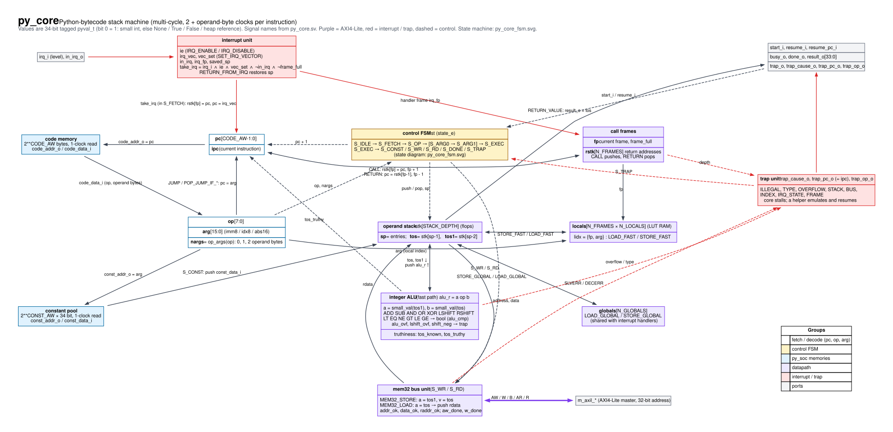
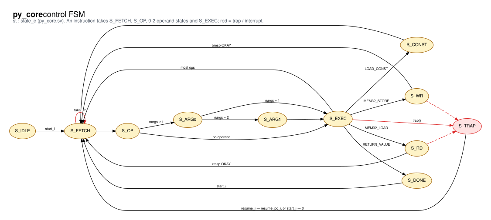
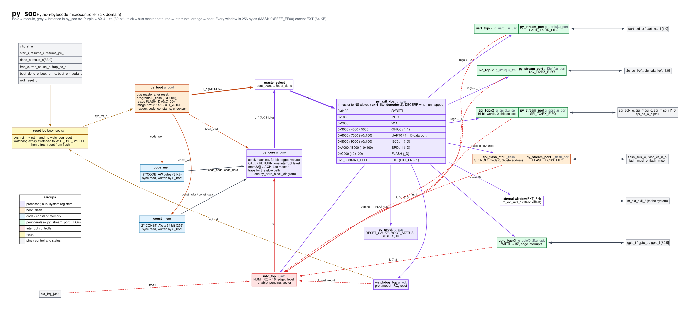

# Python microcontroller (py_core / py_soc)

A processor that executes Python bytecode directly in hardware, and a
microcontroller built around it from this library's peripherals. Python
source is compiled on the host by `py_core/tools/pyc.py` (the role
`mpy-cross` plays for MicroPython), stored in SPI NOR flash, and copied into
on-chip memory by a hardware boot loader when reset is released.

Status: architecture prototype. Simulated with iverilog, synthesized with
Yosys (slang front end) to Xilinx 7-series; not yet run on a board.

```
          SPI NOR flash ──► py_boot ──┐ (owns the bus until the image is copied)
                                      ▼
  code / const memory ◄── py_core ──► py_axil_xbar ──► SYSCTL, INTC, WDT, GPIO x3,
                                      (AXI4-Lite)       UART x2, I2C x2, SPI x2, FLASH
                                                        (+ py_stream_port FIFOs)
```

## Directory

| Path | Contents |
|---|---|
| `py_core/src/py_core.sv` | the bytecode processor |
| `py_core/src/py_core_pkg.sv` | value format, opcodes, trap causes |
| `py_core/tools/pyc.py` | Python-subset compiler, flash image writer |
| `py_core/tb/py_core_tb.sv` | core unit test (hand-assembled programs) |
| `py_soc/src/py_soc.sv` | microcontroller top level |
| `py_soc/src/py_boot.sv` | flash boot loader |
| `py_soc/src/py_stream_port.sv` | register data port with TX/RX FIFOs |
| `py_soc/src/py_axil_xbar.sv` | 1-to-N AXI4-Lite interconnect |
| `py_soc/src/py_sysctl.sv` | reset cause, boot status, cycle counter |
| `py_soc/tb/programs/selftest.py` | firmware that exercises every peripheral |
| `py_soc/tb/py_soc_tb.sv` | system test (board model, flash, I2C targets) |

## Running

```sh
make -C py_soc test     # compile selftest.py, boot it from a flash model, run it;
                        # then boot a corrupted image and expect it to be rejected
make -C py_soc wave     # same, with a VCD in build/sim/py_soc
python3 py_core/tools/pyc.py prog.py -o build/prog   # prog.flash.bin -> program your flash
```

The core unit test is run directly (it is not in `scripts/ips.csv` yet):

```sh
cd py_core && iverilog -g2012 -s py_core_tb -o /tmp/t.vvp $(cat scripts/build.f tb/scripts/build.f) && vvp -n /tmp/t.vvp
```

## The core

- **Values** are 34-bit tagged words. Bit 0 = 1 is a 33-bit signed integer,
  so every 32-bit register value (signed or unsigned) is a plain int.
  `xx10` is None/False/True; `xx00` is a heap pointer (always a trap).
- **Fast path in hardware:** integer `+ - & | ^ << >>`, comparisons,
  locals, globals, jumps, calls/returns, `mem32[]` loads and stores
  (AXI4-Lite), interrupts.
- **Slow path:** anything else stops the core with `trap_o`, a cause and the
  faulting pc; a helper can emulate it and continue at `resume_pc_i`.

| Trap | Cause |
|---|---|
| 1 ILLEGAL | opcode not in hardware |
| 2 TYPE | operand is not an int (e.g. a heap object) |
| 3 OVERFLOW | result needs a bigint; bus address/data out of range |
| 4 STACK | operand stack or call depth exceeded |
| 5 BUS | SLVERR/DECERR on a `mem32` access |
| 6 INDEX | local/global/constant index out of range |
| 7 IRQ_STATE | `RETURN_FROM_IRQ` outside the handler frame |
| 8 FRAME | `RETURN` with no caller |

Parameters: `CODE_AW` (code bytes = 2^CODE_AW, default 8 KB), `CONST_AW`
(256 constants), `STACK_DEPTH` (32), `N_LOCALS` (16 per frame), `N_FRAMES`
(16, call depth including main and an interrupt handler), `N_GLOBALS` (32).

## Python subset (pyc.py)

Supported: ints, True/False/None; `+ - & | ^ << >> ~` and unary `-`; one
comparison per expression; `not/and/or` (short-circuit); `if/elif/else`,
`while`, `break`, `continue`, `pass`; `global`; `mem32[addr]` read, write
and `mem32[a] |= v`; functions with positional parameters, return values
and recursion; `UPPER_CASE = constant` (or `const(...)`) folded at compile
time; `import` lines ignored.

Builtins: `irq_handler(fn)`, `irq_enable()`, `irq_disable()`, `halt(value)`.

Not supported (compile error): `* / % **` on variables, strings, lists,
dicts, floats, classes, default/keyword arguments, closures.

```python
UART0_D = 0x6100
RXDATA = 0x04
RX_VALID = 1 << 31
count = 0

def rx_byte(port):              # one byte, or -1 if the RX FIFO is empty
    d = mem32[port + RXDATA]
    if d & RX_VALID:
        return d & 0xFF
    return -1

def isr():                       # becomes the interrupt handler below
    global count
    while rx_byte(UART0_D) >= 0:
        count += 1

mem32[0x1000] = 1                # INTC: enable source 0 (UART0 data port)
mem32[UART0_D + 0x0C] = 1        # data port: interrupt when RX not empty
irq_handler(isr)
irq_enable()
while count < 10:
    pass
halt(count)
```

(Conditional expressions `a if c else b` are not supported yet; write the
`if` as statements.)

## py_soc

### Address map (256-byte windows; `_D` = data port)

| Base | Block | Base | Block |
|---|---|---|---|
| 0x0100 | SYSCTL | 0x8000 / 0x8100 | I2C0 / I2C0_D |
| 0x1000 | INTC (16 sources) | 0x9000 / 0x9100 | I2C1 / I2C1_D |
| 0x2000 | WDT | 0xA000 / 0xA100 | SPI0 / SPI0_D |
| 0x3000, 0x4000, 0x5000 | GPIO0-2 (32 bits each) | 0xB000 / 0xB100 | SPI1 / SPI1_D |
| 0x6000 / 0x6100 | UART0 / UART0_D | 0xC000 / 0xC100 | FLASH / FLASH_D |
| 0x7000 / 0x7100 | UART1 / UART1_D | | |

Interrupt sources (all level): 0 UART0_D, 1 UART1_D, 2 I2C0_D, 3 I2C1_D,
4 SPI0_D, 5 SPI1_D, 6-8 GPIO0-2, 9 WDT pre-timeout, 10 FLASH command done,
11 FLASH_D.

### Data ports (py_stream_port)

| Offset | Register |
|---|---|
| 0x00 | TXDATA (W): [23:0] data, [24] last; dropped and `tx_ovf` set if the TX FIFO is full |
| 0x04 | RXDATA (R): [23:0] data, [24] last, [31] valid; a valid read pops the RX FIFO |
| 0x08 | STATUS: [0] rx_valid, [1] tx_ready, [2] tx_ovf (W1C), [3] tx_empty, [19:8] RX level, [31:20] TX level |
| 0x0C | IRQ_EN: [0] RX not empty, [1] TX not full, [2] TX empty |

Receive polled: read RXDATA until bit 31 is set. Receive interrupt driven:
set IRQ_EN[0], enable the source in INTC, drain RXDATA in the handler until
bit 31 is clear. FIFO depths are SoC parameters (`UART_TX_FIFO`,
`UART_RX_FIFO`, `I2C_*`, `SPI_*`, `FLASH_*`; default 16 words each).

### SYSCTL

| Offset | Register |
|---|---|
| 0x00 | RESET_CAUSE: [0] external reset, [1] watchdog; survives system resets, W1C |
| 0x04 | BOOT_STATUS: [0] done, [1] error, [6:4] error code |
| 0x08 | CYCLES: free-running clock counter |
| 0x0C | ID: 0x5059_0100 |

### Boot

On every reset release (external or watchdog) `py_boot` reads the image at
flash address `BOOT_ADDR` (READ 03h, SPI clock = clk / (2·`FLASH_CLKDIV`)),
copies it to code and constant memory, verifies it and starts the core.
A 2 KB image boots in about 1 ms at a 16.7 MHz SPI clock.

| Bytes | Field (little endian) |
|---|---|
| 0-3 | magic `PYC1` |
| 4-5 | code length |
| 6-7 | constant count |
| 8-11 | 32-bit sum of all payload bytes |
| 12- | code bytes, then each 34-bit constant as 5 bytes |

`boot_err_code_o`: 1 bad magic, 2 size out of range, 3 checksum, 4 bus
error, 5 no data from the flash. On error the core is not started.

### Reset

`rst_n` resets everything. A watchdog expiry holds the system in reset for
`WDT_RST_CYCLES` clocks (watchdog included, so it restarts disabled), then
the system boots from flash again; firmware can read the cause in SYSCTL.

## Limitations

- One interrupt level; no nesting.
- Locals are not cleared on function entry (the compiler never reads an
  unassigned local).
- No hardware support for heap objects, so no strings, lists or bigints:
  those trap to the (not yet built) slow-path helper.
- The opcode encoding is MicroPython-inspired, not MicroPython `.mpy`.

<!-- diagrams:begin (generated by ip/scripts/update_readme_diagrams.py; edits here are overwritten) -->
## Diagrams

Data-flow diagrams are generated from the RTL by `ip/scripts/make_dataflow_diagrams.py`: inputs on the left, outputs on the right, registers as double-bordered boxes grouped by the `always` block that drives them, combinational signals as ellipses, sub-modules in yellow, AXI4-Stream / AXI4 / AXI4-Lite buses as one teal line. Click a diagram for the full-size SVG.

### `py_core` block diagram

[](py_core/docs/py_core_block_diagram.svg)

### `py_core` state machine

[](py_core/docs/py_core_fsm.svg)

### `py_soc` block diagram

[](py_soc/docs/py_soc_block_diagram.svg)

### Every IP in this category

| IP | Block / state diagrams | RTL hierarchy | Data flow |
|---|---|---|---|
| `py_core` | block (shown above), state machine (shown above) | - | [data flow](py_core/docs/py_core_dataflow.svg) |
| `py_soc` | block (shown above) | [hierarchy](py_soc/docs/block_diagram.svg) | [data flow](py_soc/docs/py_soc_dataflow.svg) |
<!-- diagrams:end -->
